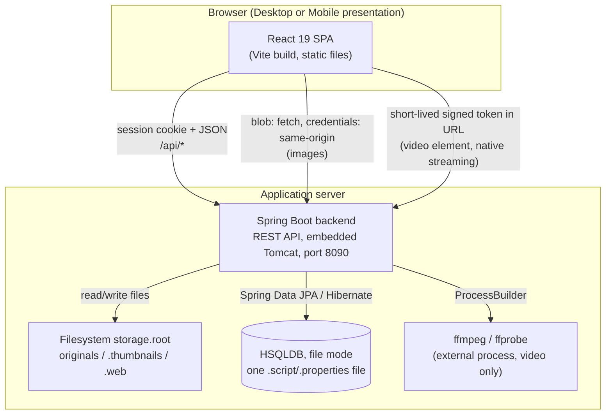
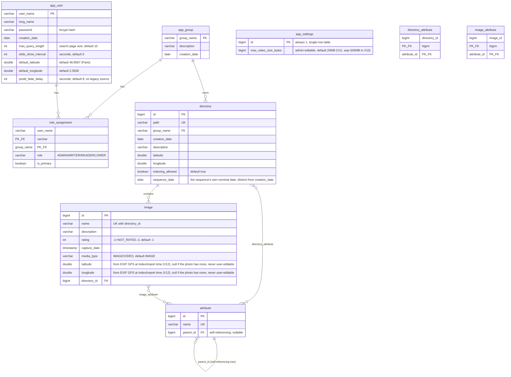
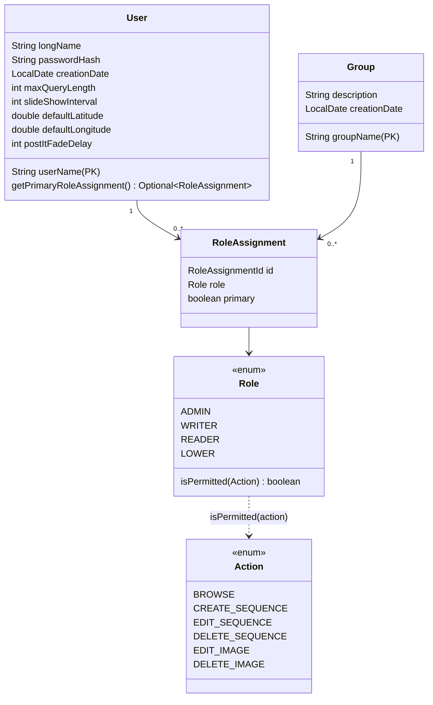
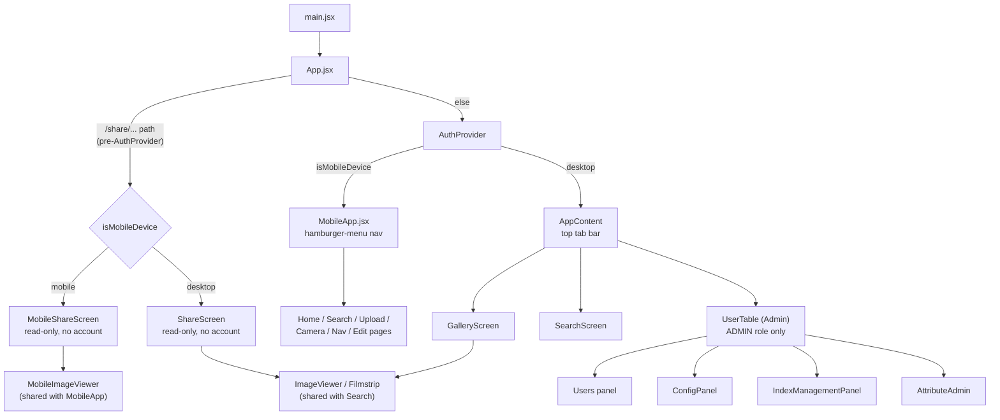

# myPhotoDiary — Design Document

Technical reference for the Spring Boot + React stack: how it's put
together, verified against the real source tree rather than written from
memory, the design decisions behind it (§14), and the analysis of the legacy
application it replaces (§15, §16). Where something is
still incomplete or a known gap, it's called out explicitly rather than
smoothed over.

Last fully reviewed for version 2.7. Features added since — sharing a
search result, the HD view, moving a sequence to another date, the
Docker image, and Caddy as the recommended web server — are described in
the README's release notes and in the Installation Guide.

## 1. Overview

myPhotoDiary is a personal photo/video diary CMS: browse, upload, tag,
search, and geolocate photo/video collections organized as a directory
tree (`year/month/sequence`), with an admin screen for user/role
management. It's a from-scratch rebuild of a legacy Java Servlet/JSP
application, migrating screen by screen ("strangler
fig") rather than a big-bang rewrite, with the legacy app kept running in
parallel throughout.

- **Backend**: Spring Boot 3.5.16, Java 21, REST API, HSQLDB (file mode)
  via Spring Data JPA, Flyway-managed schema.
- **Frontend**: React 19 + Vite, two presentation trees (Desktop/Mobile)
  sharing one API layer.
- **Storage**: server filesystem — originals, generated thumbnails, and a
  medium-resolution "web" tier live under one configurable root.
- **External tool dependency**: `ffmpeg`/`ffprobe` for video (thumbnail
  frame extraction + strict codec validation), the one thing this stack
  needs that the legacy app never did.

## 2. Architecture



**Why images and video are fetched differently in the browser** — this is
one piece of client/server wiring worth calling out up front, because it
shapes several frontend components. Session-cookie auth (18/09/2026, §7)
means a plain ``/`<video>` tag *could* now authenticate on its own
(the browser attaches the session cookie automatically) - `AuthImage.jsx`
still fetches-then-blobs anyway, but for a different, still-real reason
now (explicit cancel-on-unmount control over the request, not auth - see
that file's own comment); simplifying it back to a plain `` is a
deliberate future cleanup, not done as a side effect of the auth change.
- **Images**: fetched as bytes via `fetch()` (`credentials: 'same-origin'`
  so the session cookie is attached), converted to a `blob:` URL, handed
  to a plain `` (`AuthImage.jsx`). Fine for a photo-sized payload
  fetched once.
- **Video**: fetching a whole video into a blob first would defeat
  Range-request streaming (seeking would require re-downloading). Instead
  the backend issues a short-lived HMAC-signed token
  (`VideoStreamTokenService`) via an authenticated call, and the actual
  `<video src>` points at a token-bearing URL that's the **one** endpoint
  in the whole API explicitly `permitAll()` in Spring Security — the
  browser's own native HTTP client handles Range requests against it
  directly (`AuthVideo.jsx`).

## 3. Technical dependencies

### Backend (`backend/pom.xml`)

| Dependency | Version | Role |
|---|---|---|
| Spring Boot (parent) | 3.5.16 | Application framework |
| Java | 21 | Language/runtime |
| spring-boot-starter-web | (managed) | REST controllers, embedded Tomcat |
| spring-boot-starter-data-jpa | (managed) | Hibernate ORM via Spring Data repositories |
| spring-boot-starter-security | (managed) | Session-cookie login (`HttpSession`, 18/09/2026), CSRF, method-level `@PreAuthorize` |
| spring-boot-starter-validation | (managed) | Bean validation (`@Valid` on request DTOs) |
| flyway-core + flyway-database-hsqldb | (managed) | Versioned schema migration (V1–V12) |
| hsqldb | (managed, runtime) | Embedded SQL database, file mode |
| thumbnailator | 0.4.20 | Thumbnail/derivative generation; bakes EXIF rotation into output pixels |
| metadata-extractor | 2.18.0 | EXIF reading (capture date), same library the legacy app used |
| exec-maven-plugin | 3.5.0 (build-time only) | Runs `LegacyDataImporter`'s `main()` from the terminal |

**External process dependency (not a Maven artifact)**: `ffmpeg`/`ffprobe`
must be installed and on `PATH` (or pointed at via
`MPD_FFMPEG_PATH`/`MPD_FFPROBE_PATH`) — used only for video (first-frame
thumbnail extraction, codec validation). No server-side transcoding
happens anywhere.

### Frontend (`frontend/package.json`)

| Dependency | Version | Role |
|---|---|---|
| react / react-dom | 19.2.8 | UI framework |
| vite | 8.2.2 | Dev server + build |
| @vitejs/plugin-react | 6.1.0 | React JSX support in Vite |
| react-filepond + filepond | 7.1.3 / 4.32.12 | Drag-and-drop upload widget |
| leaflet | 1.9.4 | Interactive map (sequence geolocation picker) - replaced @googlemaps/js-api-loader 16/09/2026, no API key needed |
| i18next + react-i18next + i18next-browser-languagedetector | 26.4.0 / 17.0.12 / 8.2.1 | i18n (en/fr/de/es), browser-language auto-detection |

**Notably absent from the actual dependency tree, despite the original
proof-of-concept and the early target-stack plan**:
**PhotoSwipe**. The gallery/lightbox viewer that shipped is a hand-built
component (`ImageViewer.jsx`) — cross-fade transitions, a custom
controls bar, keyboard shortcuts, full-screen — rather than the
PhotoSwipe wrapper originally planned. This document reflects what's
actually in `package.json`, not the earlier plan.

## 4. Database schema

HSQLDB in Phase 1 (PostgreSQL planned for Phase 2 — see decision #4,
§14); schema written in portable SQL:2003 syntax so the Java code
doesn't change when that migration happens, only `application.yml`.
Managed entirely by Flyway, `V1`–`V11`, embedded on the classpath (inside
the built jar, not a separate file to deploy).



### Migration history

| # | Adds | Screen it unblocked |
|---|---|---|
| V1 | `app_group`, `app_user`, `role_assignment` | Admin (users/groups/roles) |
| V2 | `directory`, `image` (deliberately narrow — no lat/lng, no attributes yet) | Gallery/upload |
| V3 | `directory.description/latitude/longitude/indexing_allowed`, `attribute`, `directory_attribute`, `image_attribute` | Navigation/indexing, tags, search |
| V4 | `app_user.max_query_length` | Search pagination |
| V5 | `directory.sequence_date` | EXIF-based auto-sort on import |
| V6 | `app_user.slide_show_interval` | Slideshow (was a hardcoded constant before) |
| V7 | `app_user.default_latitude/default_longitude` | Map screen's geolocation picker default |
| V8 | `app_user.postit_fade_delay` | Desktop post-it auto-fade (no legacy equivalent — a new preference) |
| V9 | `image.media_type` | Video support — same table as photos, discriminated by column |
| V10 | `app_settings` (single-row) | Video upload size cap, app-wide not per-user |
| V11 | (data-only) lowers the V10 default from 500MB to 20MB | — |
| V12 | `image.latitude/longitude` | Sequence geolocation picker's per-image pins + average-based initialization |

Every migration after V2/V3 deliberately adds only the column(s) the
screen actually being built needs at that moment — a running principle
throughout this project's history: no speculative columns for a screen
not built yet.

## 5. Backend — packages and classes

```
org.myphotodiary.cms
├── CmsApplication            — Spring Boot entry point
├── config/
│   └── SecurityConfig        — session-cookie login/CSRF, method security, the permitAll() routes
├── user/                     — Admin screen: users, groups, roles, RBAC primitives
├── gallery/                  — Gallery/upload/navigation/search/video — the bulk of the app
├── settings/                 — the one app-wide (non-per-user) setting: max video size
├── backup/                   — DB backup (§10) — DatabaseBackupService, BackupMountGuard, BackupController
└── migration/
    └── LegacyDataImporter    — standalone JDBC tool, NOT a Spring bean (see §11)
```

### `user` package — accounts, groups, RBAC



- **`UserService`** — CRUD for users/groups/role-assignments, the Spring
  Data JPA replacement for the legacy `ModelFactory`.
- **`UserController`** (`/api/users/**`) — entirely `@PreAuthorize
  ("hasRole('ADMIN')")`; also exposes `GET`/`PATCH
  /api/users/{userName}/settings` so an admin can edit *any* user's
  personal settings (distinct from self-service below).
- **`MeController`** (`/api/me`) — self-service, any authenticated role,
  not ADMIN-gated: read/update your own settings. Deliberately separate
  from `UserController`.
- **`UserSettingsUpdater`** — the validation/apply logic shared by both
  of the above (bounds like slide-show-interval 2..60s), extracted once a
  second caller needed the exact same rules.
- **`DomainUserDetailsService`** — Spring Security's `UserDetailsService`
  implementation, backed by `UserRepository`.
- **`BootstrapAdminInitializer`** — a `CommandLineRunner` that seeds one
  `admin`/`admin` ADMIN account on first startup against an empty
  database (otherwise nothing could ever authenticate to create the first
  user). Logs a warning to change the password.
- **`Action`/`Role`** — the RBAC primitives (§7).

### `gallery` package — the bulk of the application

Directories, images/videos, tags, search, import, video streaming. Key
classes:

| Class | Responsibility |
|---|---|
| `Directory`, `Image`, `Attribute` | JPA entities (§4's ER diagram) |
| `GalleryService` | Directory/image CRUD, search (attribute + rating intersection, done in Java not JP-QL), pagination |
| `GalleryAuthorizationService` | Per-group RBAC enforcement (`Role.isPermitted`) — resolves the caller's role for a resource's *exact* group, throws `AccessDeniedException` |
| `DirectoryIndexerService` | Filesystem-driven directory tree, (re)indexing a tree already on disk, batch operations, hierarchical tag assignment with ancestor inheritance |
| `ImportService` | Browser upload — EXIF-based auto-sort by date, auto-created sub-sequences, photo/video branching |
| `ImageStorageService` | All file I/O — thumbnail/web-derivative generation (Thumbnailator), original storage, rename, recursive delete |
| `PathUtil` | Path-traversal-safe resolution under a storage root (`resolveUnderRoot`) — the fix for the legacy path-traversal vulnerability, ported forward |
| `ExifDateReader`, `PathDateGuesser`, `DirectoryDateRules` | Faithful ports of the legacy EXIF/filename/path date-inference chain |
| `AttributeService` | Hierarchical tag CRUD — assigning a child auto-includes ancestors; deleting a tag reparents its children rather than cascading |
| `VideoFormatValidator`, `VideoThumbnailExtractor`, `VideoStreamTokenService` | Video-specific: strict H.264/AAC validation via `ffprobe`, first-frame extraction via `ffmpeg`, HMAC-signed streaming tokens |
| `MediaType` | `IMAGE`/`VIDEO` discriminator on the `image` table — no parallel `Video` entity, so every existing feature (tags, search, RBAC, rating) works unmodified for video |
| `ShareTokenService` | HMAC-signed, stateless, 30-day external share tokens — `IMAGE`/`SEQUENCE` scope + target id in the payload, own secret from `VideoStreamTokenService`'s; no DB row, no schema change |
| `ShareController` | Issues share tokens (authenticated, RBAC-checked) and serves the `permitAll()` `/api/public/**` read surface they unlock |
| `*Controller` (7 of them) | REST surface — see §6 |
| `GalleryApiExceptionHandler` | `@RestControllerAdvice` mapping domain exceptions to HTTP status codes |

### `settings` package

`AppSettings` (singleton row, id always 1), `AppSettingsService`,
`AppSettingsController` (`GET` open to any authenticated user, `PATCH`
ADMIN-only) — the one app-wide, non-per-user setting so far (max video
size), deliberately separate from the `user`-table-column pattern every
other setting uses.

### `migration` package

`LegacyDataImporter` — a standalone `main()`, plain JDBC, **not** a
Spring bean, run via `backend/scripts/import-legacy-data.sh` (`mvn
exec:java`). Converts a legacy HSQLDB database into this backend's own
Flyway schema: groups → users → role assignments → directories →
attributes → images → the two join tables, every phase an upsert so a
re-run is always safe. Reports a summary + warnings (non-bcrypt passwords
needing reset, orphaned foreign keys the legacy schema never enforced).
Does not touch image/video files on disk — that's a separate `rsync` +
"Batch Publish" step, which regenerates thumbnails.

## 6. REST API reference

Every endpoint requires a signed-in session (cookie, §7) except the ones
marked `public`, plus `POST /api/login` itself (unauthenticated by
definition). `ADMIN` means `@PreAuthorize("hasRole('ADMIN')")`; `RBAC`
means enforced per-group by `GalleryAuthorizationService` (§7); no note
means "any authenticated role."

| Method | Path | Access | Purpose |
|---|---|---|---|
| POST | `/api/login` | **public** (CSRF-exempt, §7) | Session-cookie login |
| POST | `/api/logout` | any (CSRF-protected) | Invalidate the session |
| GET | `/api/me` | self | Own profile + settings |
| PATCH | `/api/me` | self | Update own settings |
| GET | `/api/users` | ADMIN | List users |
| GET | `/api/users/{userName}` | ADMIN | Get one user |
| POST | `/api/users` | ADMIN | Create user |
| PUT | `/api/users/{userName}` | ADMIN | Update user |
| DELETE | `/api/users/{userName}` | ADMIN | Delete user |
| GET/POST/DELETE | `/api/users/{userName}/roles[/{groupName}]` | ADMIN | Role assignments |
| GET/PATCH | `/api/users/{userName}/settings` | ADMIN | Admin edits *another* user's settings |
| GET | `/api/app-settings` | any | Read app-wide settings (max video size) |
| GET | `/api/version` | Authenticated | Version of the backend jar actually running (Spring Boot build-info), shown in Admin → Configure |
<!-- app-settings now also carries targetUploadSeconds (V13) - drives frontend/src/upload/adaptiveShrink.js -->
| PATCH | `/api/app-settings` | ADMIN | Update app-wide settings |
| GET | `/api/directories` | any (read) | List directories (provisional flat selector) |
| POST | `/api/directories` | RBAC `CREATE_SEQUENCE` | Create a directory |
| GET | `/api/directories/by-path` | any | Resolve a filesystem path to its DB row |
| GET | `/api/directories/{id}` | any | Get one directory |
| PATCH | `/api/directories/{id}` | RBAC `EDIT_SEQUENCE` | Update comment/geolocation/attributes |
| POST | `/api/directories/{id}/rename` | RBAC `EDIT_SEQUENCE` | Move files + cascade path change to descendants |
| GET | `/api/directories/{directoryId}/images` | any | List images in a directory |
| POST | `/api/directories/{directoryId}/images` | RBAC `CREATE_SEQUENCE`/`EDIT_SEQUENCE` | Fixed-directory upload (vestigial — see §10) |
| GET | `/api/images/search` | any | Paginated attribute+rating+date-range+free-text search |
| PATCH | `/api/images/{imageId}` | RBAC `EDIT_IMAGE` | Edit description/rating/tags |
| DELETE | `/api/images/{imageId}` | RBAC `DELETE_IMAGE` (ADMIN only — §7) | Delete an image |
| GET | `/api/images/{imageId}/thumbnail` | any | 128px thumbnail bytes |
| GET | `/api/images/{imageId}/web` | any | 1600px "web" tier (falls back to original) |
| GET | `/api/images/{imageId}/original` | any | Full original bytes |
| GET | `/api/images/{imageId}/export` | any | Same bytes as `/original`, `Content-Disposition: attachment` |
| POST | `/api/import` | RBAC `CREATE_SEQUENCE`/`EDIT_SEQUENCE` | Browser upload — EXIF auto-sort, one file at a time |
| GET | `/api/directory-tree` | any | Lazy-loaded, filesystem-driven navigation tree |
| GET | `/api/directory-tree/all` | any | Fully flattened tree, for batch operations |
| POST | `/api/directory-index` | any (see §7 note) | Index a directory found on disk |
| DELETE | `/api/directory-index` | RBAC `DELETE_SEQUENCE` | Reset (DB only) or delete (DB + files) an index |
| POST | `/api/directory-index/batch` | RBAC `DELETE_SEQUENCE` | Same, on multiple paths at once |
| POST | `/api/directory-index/batch-publish` | any | Recursively index a whole server-side tree |
| GET | `/api/attributes` / `/api/attribute-tree` | any | List tags, lazy tree |
| POST/PATCH/DELETE | `/api/attributes[/{id}]` | ADMIN | Tag CRUD, including reparenting |
| GET | `/api/videos/{imageId}/token` | any | Issue a short-lived video streaming token |
| GET | `/api/videos/{imageId}/stream` | **public** | Range-request video streaming, validated by its own signed token, not Spring Security |
| POST | `/api/images/{imageId}/rotate` | RBAC `EDIT_IMAGE` | Rotate original/web/thumbnail 90° × `quarterTurns` (optional, 1..3, default 1) right in place, one re-encode (rejects video) |
| GET | `/api/images/{imageId}/share-token` | any | Issue a 30-day, IMAGE-scoped external share token |
| GET | `/api/directories/{directoryId}/share-token` | any | Issue a 30-day, SEQUENCE-scoped external share token |
| GET | `/api/public/images/{imageId}` | **public** | One shared image's metadata, validated by its own signed token, not Spring Security |
| GET | `/api/public/images/{imageId}/thumbnail` / `/web` | **public** | Shared image bytes, same token validation |
| GET | `/api/public/sequences/{directoryId}` | **public** | A shared sequence's images (video excluded), same token validation |
| GET | `/share/image/{imageId}` / `/share/sequence/{directoryId}` | **public** | Crawler-facing HTML with real per-share `og:image` tags (`ShareLinkPreviewController`, 25/09/2026) — not `/api/*`, this is the exact public share URL itself, only ever reached by a known link-preview bot (the web server's User-Agent-conditioned routing, real visitors keep hitting the static SPA) |
| GET | `/api/admin/backups` | ADMIN | DB snapshot list + image-tree backup status (§10) |
| POST | `/api/admin/backups/db` | ADMIN | Trigger a DB backup now |

## 7. Authentication & authorization

**Authentication**: session-cookie login (18/09/2026, replaces HTTP Basic —
explicit ask: "fix the basic authentication weakness and use session
cookies"). The real weakness fixed: the previous frontend kept the raw
username/password in `sessionStorage` and re-sent them as a Basic header
on every API call — any future XSS would leak the literal password, not
just a session. Backed by the embedded Tomcat's own `HttpSession`
(Spring Security's default `HttpSessionSecurityContextRepository`), a
deliberate choice over a custom stateless/JWT scheme — this app is
already explicitly single-instance (HSQLDB file-mode precludes
clustering), so the one real downside of an in-memory session (doesn't
survive multiple JVM instances, or a restart of this one) isn't a real
constraint here, the same "everyone re-authenticates, a rare event"
trade-off already accepted for the video/share token secrets' own
random-per-restart-key fallback. `POST /api/login`
(`UsernamePasswordAuthenticationFilter`, no dedicated `@Controller`) sets
the cookie; `POST /api/logout` invalidates it. Cookie lifetime: 24h,
surviving a browser restart (`server.servlet.session.cookie.max-age`,
explicit ask — not Tomcat's 30-minute idle default, not a browser-lifetime-
only cookie either), `HttpOnly` + `Secure` (requires HTTPS on whatever
origin the browser talks to — the web server (Caddy) in production, the
mkcert-backed Vite dev server locally).

**CSRF**: re-enabled (`.csrf(...)`, was `.disable()`'d correctly under
Basic auth — a forged cross-site request couldn't attach a custom
`Authorization` header, so there was nothing to protect against that a
cookie doesn't now reintroduce). The standard SPA pattern from Spring's
own reference docs: `CookieCsrfTokenRepository.withHttpOnlyFalse()`
exposes an `XSRF-TOKEN` cookie to JS, `client.js`'s `apiFetch` echoes it
back as the `X-XSRF-TOKEN` header on every mutating request (GET/HEAD are
exempt). Two real gotchas found by writing a real end-to-end HTTP test
before trusting this, not assumed from documentation alone
(`SecurityConfigAuthFlowTest`):
- Spring Security 6's *default* CSRF request handler
  (`XorCsrfTokenRequestAttributeHandler`) BREACH-masks the token value,
  which breaks the simple "read the cookie, echo it back verbatim" SPA
  pattern — fixed with an explicit plain `CsrfTokenRequestAttributeHandler`.
- A CSRF rejection on an *unauthenticated* request (e.g. a forged login
  attempt) gets routed through the `authenticationEntryPoint`, not a 403 —
  made a real login attempt indistinguishable from "wrong password" until
  `/api/login` itself was explicitly exempted from CSRF (`.ignoringRequestMatchers("/api/login")`;
  not a real exposure — a forged login using attacker-supplied credentials
  only ever logs the victim into the *attacker's* account, gaining the
  attacker nothing). `/api/logout` stays CSRF-protected — by the time it's
  called there's already a real session with a real token to require.

Passwords: bcrypt (`BCryptPasswordEncoder`), same algorithm the legacy
app was retrofitted to use, so hashes are portable between the two.

**Authorization** — two independent mechanisms:

1. **Screen-level, coarse**: `@PreAuthorize("hasRole('ADMIN')")` on
   `UserController` and the tag-mutation endpoints of `AttributeController`
   — an all-or-nothing gate for genuinely admin-only screens.
2. **Resource-level, per-group**: `GalleryAuthorizationService` resolves
   the caller's role for a resource's *exact* owning group (no fallback to
   a different group) and checks it against `Role.isPermitted(Action)`:

   | | BROWSE | CREATE_SEQUENCE | EDIT_SEQUENCE | EDIT_IMAGE | DELETE_SEQUENCE | DELETE_IMAGE |
   |---|---|---|---|---|---|---|
   | **ADMIN** | ✓ | ✓ | ✓ | ✓ | ✓ | ✓ |
   | **WRITER** | ✓ | ✓ | ✓ | ✓ | ✗ | ✗ |
   | **READER** | ✓ | ✗ | ✗ | ✗ | ✗ | ✗ |
   | **LOWER** | ✓ | ✗ | ✗ | ✗ | ✗ | ✗ |

   `BROWSE` is checked unconditionally, `WRITER` was widened to include
   `CREATE_SEQUENCE` (28/08/2026, explicit ask — deviates from a strict
   legacy port; deletion stays ADMIN-only either way, not asked for and
   the most consequential action to keep restricted). A path with **no**
   matching `Directory`/`Image` row yet (a file just dropped on disk) is
   treated as belonging to the "public" group for this check, not as an
   authorization-free zone — closing a real bypass the legacy app also
   had for exactly this case.
3. **Stateless signed tokens, bypassing Spring Security's own auth
   entirely**: `VideoStreamTokenService` (4-hour TTL) and
   `ShareTokenService` (30-day TTL) — both HMAC-SHA256, both `permitAll()`
   on their own `GET` routes (`/api/videos/*/stream`, `/api/public/**`),
   both with their own separate secret so leaking/rotating one never
   affects the other. Issuing a token (`GET .../token`, `GET .../share-
   token`) still requires a normal signed-in session and, for share tokens,
   the same RBAC check as any other read of that resource; only
   *redeeming* one is unauthenticated by design — that's the whole point
   of a link an external, account-less viewer can open. A share token
   further carries its own scope (`IMAGE` or `SEQUENCE`) and target id,
   checked on every redemption — an image-scoped token never grants
   access to a different image or to its owning sequence's other photos,
   and a video is never included in what a token can reach (rotation and
   sharing both exclude video, for different reasons — see §8/§10).

## 8. Image and video support

**Photo formats** — anything Java's own ImageIO/Thumbnailator pipeline
can decode; the extension allowlist used for filesystem scanning
(`ImageStorageService.IMAGE_EXTENSIONS`, matching the legacy indexer's own
list) is: **jpg, jpeg, png, gif, bmp, tiff, webp**. EXIF orientation is
baked into the output pixels at thumbnail-generation time (Thumbnailator),
so — unlike the legacy `Image.orientation` column — there's nothing to
persist for it at all.

**Video format — deliberately strict, one format only**: **MP4
container, H.264 video codec, AAC audio (or no audio track)**. Enforced
by actually probing the codec via `ffprobe` (`VideoFormatValidator`), not
just trusting the `.mp4` extension — a phone recording in "High
Efficiency" mode can produce HEVC inside a `.mp4` container, which this
rejects with an explicit message rather than silently failing to play in
Safari. **No server-side transcoding** — what's uploaded must already be
playable by a plain HTML5 `<video>` tag everywhere. Detected purely by
`.mp4` extension at upload time (`ImportService.VIDEO_EXTENSIONS`) before
the codec-level check runs.

**Derivatives generated per file**:

| Tier | Photos | Videos |
|---|---|---|
| Thumbnail (128px) | Thumbnailator, from the original | `ffmpeg -vframes 1` first-frame extraction, then the same Thumbnailator resize |
| "Web" (1600px) | Thumbnailator | *(none — the player streams the original directly, Range-request)* |
| Original | stored as uploaded | stored as uploaded |

Size cap: `app_settings.max_video_size_bytes`, admin-editable at runtime
(Admin → Configure), default 20MB (V11). No equivalent cap on photos.

**Fallback chain for photo derivatives** (`ImageStorageService`, 02/09/2026):
a request for a missing derivative file falls back rather than failing —
thumbnail → web → original, web → original. Guards against a row indexed
before a derivative-path layout change (the 31/08/2026 restructure to
co-located `.thumbnails`/`.webimg`, see §12) whose real file still sits at
the old location until that directory is re-indexed; re-indexing
regenerates the real file unconditionally either way. No such fallback for
a video's thumbnail (`ffmpeg` extraction has no equivalent smaller tier to
fall back to).

## 9. Frontend architecture

Single Vite/React project, **one shared API/hooks layer**
(`src/api/*.js`) consumed by **two separate presentation trees** —
Desktop (`src/gallery/*`, `src/components/*`) and Mobile (`src/mobile/*`)
— decided by `isMobileDevice()` (`deviceDetection.js`), a verbatim port
of the legacy User-Agent regex (`Mobi|mobi|Tablet|tablet|Android|android`),
evaluated once per page load, not reactively on resize. The two
presentations differ by more than layout: no keyboard shortcuts,
slideshow, full-screen, or delete on mobile; reduced edit forms; a native
camera-capture entry point; no Admin/Tags screens at all (the legacy
`admin.jsp` never had a mobile counterpart either).



**Desktop-specific**: `DirectoryTree` (lazy filesystem-driven navigation),
`Popup` (reusable modal matching the legacy black popup styling exactly),
cross-fade transitions between images, a post-it comment widget with a
hover/pinned/fade state machine, drag-and-drop tag reparenting.

**Share links**: `ImageViewer`/`Filmstrip` (desktop) and
`MobileImageViewer` (mobile) all accept a pluggable `ImageComponent` prop
(defaulting to `AuthImage`, the normal `Authorization`-header fetch) —
`ShareScreen`/`MobileShareScreen` pass `PublicImage` instead (same `blob:`
fetch, no auth header, the token already lives in the URL query string),
so the read-only public viewer is visually and behaviorally identical to
the authenticated one without a second, forked implementation.

**i18n**: `react-i18next`, four languages (**en/fr/de/es**), 179 keys each
(parity verified programmatically), browser-language auto-detection with
a manual switcher, English fallback. en/fr are ported from the legacy
`Labels.properties`/`Labels_fr.properties`; de and es are both fresh,
from-scratch translations (no legacy equivalent for German; the legacy
`Labels_es.properties` exists but is mojibake-corrupted, deliberately
never read as a source for the new es.json either).

**Visual fidelity**: a deliberate project-wide constraint (decision #8,
§14) — the gallery, post-its, filmstrip ("film" texture), and
upload screens are pixel-level ports of the legacy CSS/assets (`idx.css`,
real legacy PNG assets copied byte-for-byte), not a "modernized" redesign.
The Admin screen is the one deliberate exception — its legacy dark-hive
jQuery-UI theme was never treated as identity worth preserving, so it uses
plain white-surface form styling instead.

## 10. Feature list

**Gallery & upload**
- Filesystem-driven directory tree; a directory dropped directly on the
  server appears before anything indexes it.
- Browser upload (FilePond) with EXIF-based auto-sort by capture date
  into `year/month`, optional auto-created named sub-sequence — a
  per-file destination, not a single fixed target (the older
  fixed-directory upload endpoint still exists but is effectively
  vestigial once this shipped).
- Direct filesystem drop + (re)indexing, still a first-class supported
  workflow, not just the browser path.
- Photo *and* video upload (strict MP4/H.264, see §8).
- Thumbnails, a medium "web" resolution tier, full-original download/export.
- Post-it style comments at both directory and image level; star rating
  (4 levels, matching legacy `NOT_RATED`..`VERY_GOOD`).
- Slideshow, full-screen, cross-fade transitions, next-image preloading,
  keyboard shortcuts (arrows, space, escape).
- Sequence rename (moves files, cascades path changes to descendants).
- Sequence geolocation via an interactive Leaflet/OpenStreetMap picker
  (draggable marker, no API key required) - shows a read-only dot for every
  image in the sequence that carries EXIF GPS (`image.latitude/longitude`,
  V12, read at index/import time, never user-editable), and, when the
  sequence itself has no saved position yet, starts the draggable marker at
  the average of those dots rather than jumping straight to the account's
  own default map center.
- 90°-right image rotation (original + web + thumbnail rewritten in place,
  atomically; excluded for video) via a second, bottom-edge hover toolbar.
- External share links — copy a signed, 30-day, no-login-required URL for
  a single image or a whole sequence to the clipboard (top/bottom hover
  toolbars); opens in a read-only viewer (`ShareScreen`/
  `MobileShareScreen`) reusing the same `ImageViewer`/`Filmstrip`
  components with no Authorization header, browse-and-play only, no Search
  screen equivalent.

**Tags (attributes)**
- Hierarchical, assignable to directories and images independently.
- Assigning a child auto-includes its ancestors; deleting a tag reparents
  its children instead of cascading.
- Drag-and-drop reparenting in the admin tag tree.
- Create-and-assign a brand-new tag inline from the Image/Sequence edit
  forms (Desktop only, 03/09/2026, restores legacy's `#newImgParam`/
  `#newDirParam`) - `GalleryService.updateImage`/`DirectoryIndexerService
  .updateDirectoryDetail` find-or-create an unknown attribute name rather
  than reject it, deliberately not routed through the ADMIN-only `POST
  /api/attributes`, so this inherits the `EDIT_IMAGE`/`EDIT_SEQUENCE`
  authorization already checked there instead (available to WRITER, not
  just ADMIN, matching legacy).

**Search**
- Multi-attribute filter (all given tags must match at once, a directory's
  own tags *or* an image's own - inherited-from-directory search) and
  free-text filter (`text`, 03/09/2026, revised same day) - matches the
  sequence name (its path's last segment), sequence description, or image
  description - are ORed *together* (tag match is one alternative among
  four, not a separate hard filter), then that whole disjunction is ANDed
  with date range and minimum rating: `minDate AND maxDate AND minRating
  AND (tag OR name OR seqDesc OR imgDesc)`. `text` is ignored below 4
  characters (an omitted criterion, not "match nothing" - the disjunction
  still degrades gracefully when neither tags nor a long-enough `text` are
  given). Debounced client-side on desktop, and skipped there below the
  same 4-character minimum purely to avoid firing a request the backend
  would ignore anyway (mobile searches on submit, not live, so no debounce
  needed).
- Date-range filter.
- Paginated, page size = the signed-in user's own `max_query_length`
  setting; infinite scroll via `IntersectionObserver`.
- Shares the exact same viewer/filmstrip presentation as the Gallery
  screen (not a separate grid+modal).
- Desktop only: a Gallery-sidebar-style left column with two buttons -
  download every original in the full match set, or just the currently
  displayed one - straight into a folder the user picks via the File
  System Access API (`showDirectoryPicker`, Chromium-only - see §12).
  Fetches the complete result set for the "all" case independently of
  the filmstrip's own infinite-scroll pagination state.

**Admin** (desktop only, ADMIN role only)
- User/group/role-assignment CRUD, hand-built table component.
- Per-user settings editable for *any* user, not just self.
- App-wide settings (video size cap).
- Bulk directory index/reset/delete operations, recursive "Batch Publish."
- Tag tree management.
- Backup (18/09/2026) - see the dedicated "Backup" bullet below.

**Video**
- Strict MP4/H.264(+AAC) upload validation, first-frame thumbnail.
- Token-authenticated Range-request streaming (seekable, no full-file
  download).

**Backup** (18/09/2026, explicit ask — see `BackupProperties`/
`DatabaseBackupService`/`BackupMountGuard`/`backup-images.sh`'s own javadoc
for the full rationale)
- Two independent halves, matched to what they move: the DB (small,
  metadata-only) is snapshotted from inside the backend itself via
  HSQLDB's own online `BACKUP DATABASE TO '<dir>' BLOCKING AS FILES`
  (nightly `@Scheduled`, cron configurable, plus an Admin-triggered
  `POST /api/admin/backups/db`); the original photos/videos (the bulk of
  the data — `.thumbnails`/`.webimg` are deliberately excluded, both
  regenerable from the originals via re-index/Batch Publish) are copied by
  a separate shell script (`backup-images.sh`, `rsync -a --link-dest`
  hardlink snapshots — the standard low-overhead pattern for a mostly
  append-only library) on its own daily systemd timer, never from a web
  request.
- **Mount guard, the central safety property**: both halves refuse to
  write anything unless the configured backup root is a genuinely distinct
  mounted filesystem from its parent (`BackupMountGuard` in Java,
  `mountpoint -q` in shell) — a plain local directory at that path,
  waiting for a NAS/second-disk mount that hasn't happened yet, is treated
  as "not ready" and skipped cleanly (visible in the Admin Backup panel
  and in `backup-images.sh`'s own `status.json`/logs), not silently
  treated as a successful same-disk "backup" that would protect against
  nothing. `MPD_BACKUP_REQUIRE_MOUNT=false` is the deliberate, explicit
  override for local dev/testing or an informed same-disk choice.
- Retention (days, configurable) prunes old snapshots automatically on
  each successful run, on both halves independently, never touching a
  directory whose name doesn't parse as one of this feature's own
  timestamps.
- Restore (`restore-db.sh`, `restore-images.sh`) is shipped in the `.deb`
  package (available on the server without a git checkout at the moment
  it's actually needed) but **deliberately never automated or exposed via
  any endpoint/UI button** — dry-run by default, explicit `--yes` to act,
  same discipline as `LegacyDataImporter`/`DuplicateDirectoryMerger`.
  `restore-db.sh` also keeps a timestamped copy of whatever live DB files
  it's about to overwrite before touching them.
- Admin UI: a fifth Admin sub-tab ("Backup") — mount status, a "back up
  now" button + DB snapshot table, and read-only visibility into the
  image-tree backup's own last-run status (no trigger button for that
  half, by design).
- **Exercised against a real NAS** — first verified end-to-end against a
  real, genuinely mounted filesystem (a disposable local disk image, not
  just the guard logic in isolation), then against a real production NAS
  (§12).

**Mobile** (separate presentation, same data layer)
- Single-level drill-down navigation (browse-in/back-out).
- Swipe left/right between images, double-tap to reveal chrome (single
  tap changed to double-tap 09/09/2026, to stay unambiguous with the
  mosaic screen's own single-tap-to-select) — same double-tap-to-reveal
  gesture on the mosaic screen too (`useDoubleTap`, shared hook), single
  tap there staying exclusively "select this thumbnail".
- Two view modes for the current sequence (09/09/2026, no legacy
  counterpart): the single-image screen (unchanged) and a new mosaic
  screen (`MobileMosaicView`) — a grid of thumbnails, packed into
  fixed-height rows (own aspect ratio, learned once each thumbnail loads —
  `ImageResponse` still has no width/height field, a known gap, §12) and
  paged horizontally (swipe) rather than scrolled vertically, row count
  driven by measured available height so portrait fits more rows than
  landscape. Switched by pinching, not a button: pinch-out on the
  single-image screen while the picture is at 1x enters the mosaic;
  pinch-in on the mosaic (`usePinchGesture`) returns to the single-image
  screen on whichever thumbnail is current.
- Picture zoom (single-image screen): done by `MobileImageViewer` itself
  (CSS transform on `.mobile-zoom-layer`, pinch to zoom 1x-2x around the
  fingers, one-finger pan clamped to the picture's edges, reset on picture
  change/resize; a horizontal swipe that starts with the picture already
  against that edge goes to the next/previous picture), not by the browser's page zoom - which magnified the
  overlaid corner bars too, and isn't available in element full-screen.
  Page zoom is blocked on the home page (`touch-action: pan-x pan-y`,
  plus `useBlockNativePageZoom` for iOS gesture events); other mobile
  pages keep it. Session start always defaults to the single-image
  screen.
- Reduced edit forms (description only), no slideshow/full-screen/delete.
- Native camera capture entry point, PWA "Add to Home Screen" manifest.
- Landscape: auto-fullscreen on the next tap (`useLandscapeFullscreen`,
  03/09/2026) — a browser only grants `requestFullscreen()` inside a real
  user gesture, never on an orientation-change event alone, so this arms
  itself on rotation and fires on the next tap rather than instantly;
  auto-exits on rotating back to portrait (no gesture needed to leave).
  Secondary pages with a persistent header (Search/Upload/edit forms/
  sign-in) also get a shrunk header in landscape via CSS
  (`@media (orientation: landscape)`); the home/gallery screen's own
  header/footer were already tap-to-reveal overlays claiming no space in
  either orientation, so nothing needed changing there.

**Cross-cutting**
- i18n (en/fr/de/es).
- RBAC (§7).
- Legacy HSQLDB → new schema data migration tool
  (`LegacyDataImporter`/`import-legacy-data.sh`).

## 11. Testing

196 backend tests (JUnit 5 + `@SpringBootTest`, real HSQLDB in-memory per
test class — `DatabaseBackupServiceTest` is the one deliberate exception,
built against a real *file-mode* HSQLDB it constructs by hand, since
`BACKUP DATABASE` is a documented no-op against an in-memory catalog; see
its own javadoc), covering services, controllers, path-traversal safety, RBAC,
EXIF/date-inference logic, video validation (real `ffmpeg`-generated
fixture files, not fabricated bytes), the legacy data importer's own
transactional correctness (a real dry-run-doesn't-actually-roll-back bug
found running it against a real 43,822-image production database, fixed,
and now regression-tested), share-token issuance/validation/scoping
(`ShareTokenServiceTest`, `ShareControllerTest` — real temp-dir storage,
no mocking), in-place image rotation (`GalleryServiceTest` — real
decoded-dimension swap on all three derivatives, video rejection), the
thumbnail-tier fallback (real thumbnail file deleted after upload, confirms
the fallback chain to web then original), and the free-text search filter
(sequence name/sequence description/image description matching, and its
AND-with-everything-else / OR-within-itself logic specifically), and
attribute deletion actually clearing every reference to it from tagged
images/directories (the DB-level `ON DELETE CASCADE` on
`image_attribute`/`directory_attribute`, not application code — see §4 —
verified red/green against the real constraint, not just read from the
migration), and the backup feature (18/09/2026 — see §10/§12): a real
online `BACKUP DATABASE` snapshot restored into a fresh connection and read
back row-for-row, retention pruning that only ever touches directories
this service's own naming recognizes, and graceful (not thrown) failure
both when the mount guard refuses and when the underlying database can't
run the command at all, and the session-cookie login/logout/CSRF flow
(18/09/2026, `SecurityConfigAuthFlowTest` — a real end-to-end HTTP client
against a random-port embedded Tomcat, not `@WithMockUser`/direct method
calls: login sets a real session cookie a follow-up request can use with
*no* other credentials, a wrong password issues no cookie at all, a
mutating request is rejected without the CSRF header and accepted with
it, and logout genuinely invalidates the session rather than just
clearing client-side state).
No frontend automated test suite yet — frontend changes have instead been
verified through direct, real-browser (Playwright/Chromium) checks against
running dev instances, slice by slice.

## 12. Known limitations / not yet built

- **Auth strategy resolved (18/09/2026)** — session-cookie login, backed
  by the embedded Tomcat's own `HttpSession` (§7). No longer an open
  decision/placeholder.
- **No client-side routing, one narrow exception** — `App.jsx` switches
  every normal screen with plain `useState`, not a router; nothing there
  is deep-linkable or bookmarkable, and the browser back/forward buttons
  don't navigate within the app. Flagged as the most structural gap from
  the functional-parity audit (§15). Share links
  (02/09/2026) are the one exception, and only because they have to work
  for a visitor with no account at all: a plain regex against
  `window.location.pathname`, checked before `<AuthProvider>` even mounts
  — not a general-purpose router, doesn't touch history/back-forward, and
  doesn't reduce the gap for anything else in the app.
- **Backup/restore, resolved end-to-end against a real production NAS
  (18-23/09/2026, see §10)** — no longer a pending deployment step. The
  real NAS turned out to need three separate, stacked fixes before either
  backup half could write to it at all: the shared folder's default
  `root:root` ownership (fixed with `chown` to the service account), NFSv4
  silently squashing that account's own writes to `nobody` via its own
  separate identity-mapping domain layer (worked around by mounting NFSv3/
  `sec=sys` instead — raw UID/GID, no domain to mismatch), and the NAS's
  own ACL system resetting the share's Unix permission bits to `000` on its
  own (fixed by re-applying `chmod`). None of these were HSQLDB/Java bugs
  — `BackupMountGuard`'s own refuse-to-write-until-really-mounted design
  did exactly its job throughout, surfacing each failure cleanly instead
  of writing a false "backup" locally. A real DB snapshot and a real
  image-tree `rsync` both completed successfully once fixed. (The legacy
  app's own backup/export links were already disabled in its source
  before this project started, for what it's worth as prior art.)
- **Multi-file Publish upload race, fixed (22/09/2026)** — FilePond's own
  `maxParallelUploads: 2` default genuinely fires concurrent `/api/import`
  requests; two files landing in the same not-yet-existing directory (the
  common case) used to race each other's `INSERT` on `directory.path`'s
  UNIQUE constraint, the loser surfacing as a plain 500. Fixed with a
  per-path in-JVM lock (`ImportService.resolveOrCreateDirectory`), held
  until the transaction actually commits (`TransactionSynchronizationManager`),
  not a `REQUIRES_NEW` nested transaction — a first version used exactly
  that and self-deadlocked against HSQLDB's lock-based transaction manager
  whenever called from a thread with an already-open transaction on the
  same table (every `@Transactional` test in this project, and a real risk
  for any future non-HTTP caller). Portable to the planned PostgreSQL
  migration (§12's own phase-2 note below) - a plain JVM lock, no
  DB-specific error-catching involved.
- **Image-tree backup was silently deleting its own snapshot every run,
  fixed (23/09/2026)** — found live against a real production NAS,
  minutes after the three-layer NFS fix above finally let a real backup
  write successfully: `rsync -a` (implies `-t`) sets the freshly-created
  top-level snapshot directory's own mtime to match the *source* root's
  own mtime, not "now" — on a long-lived library that can be months old,
  since a directory's mtime only changes when an entry is added/removed
  directly inside it. `backup-images.sh`'s retention step
  (`find -mtime +$RETENTION_DAYS`) inherited that stale mtime and deleted
  the snapshot it had just finished writing, in the same run, after
  `write_status` had already (honestly) recorded success — hence
  `status.json` reporting `success:true` while the actual snapshot
  directory was gone. Fixed with an explicit `touch "$SNAPSHOT_DIR"` right
  after rsync completes; a failed rsync's partial snapshot is now also
  removed rather than left as an un-pruned, un-counted orphan. Confirmed
  by a faithful local reproduction (red before the fix, green after,
  genuine old snapshots still pruned correctly). `MPD_BACKUP_RETENTION_DAYS`'s
  default also raised 14 → 30 days in the same change, a separate, bundled
  request. An installation upgrading from an affected version should
  check its own retention setting and trigger one fresh image backup.
- **Per-image tag assignment UI on mobile** doesn't exist (backend
  supports it; desktop has it via a multi-select).
- **Phase 2 (PostgreSQL)** not started — schema is written to be portable
  when it is.
- **Read-visibility RBAC is partial, by deliberate choice** (12/09/2026) —
  viewing an image/sequence's *content* (list images, thumbnail/web/
  original/export, sequence description/geolocation, search results) now
  requires at least one role assignment in that sequence's group (`BROWSE`
  is enforced there); admin-global users bypass this as expected. Browsing
  the directory *tree structure itself* (`GET /api/directory-tree`) stays
  intentionally open to any authenticated user regardless of group — an
  explicit ask, so a family member can still see a sequence exists (and
  its path/name) without necessarily being able to open it, rather than
  the tree silently pruning branches per viewer.
- **Rows indexed before the 31/08/2026 co-located-derivative restructure
  (`.thumbnails`/`.webimg` moved from a centralized mirror tree into each
  sequence directory itself) still point at the old location until their
  directory is re-indexed** — `/thumbnail` falls back to web/original
  rather than 404ing (§8), but that's a stopgap, not a substitute for
  actually re-running the index (Admin → Index management, or
  `batch-publish`) on any directory that predates the restructure. Found
  live (02/09/2026) affecting most of a local dev database's images;
  plausibly true of any data migrated before this restructure and not
  fully re-indexed since.
- Deployment documentation: the Installation Guide (building,
  installing and administering an instance). The one-time migration of a real
  legacy installation was done with a separate, private runbook, since
  it necessarily contains real server details.
- **Bulk directory indexing is single-threaded within one request**
  (found 31/08/2026, running the real historical thumbnail backfill
  against 12 real CPU cores — only one was ever active).
  `DirectoryIndexerService.batchIndex`'s loop over directories and
  `indexDirectory`'s loop over files are both plain sequential `for`
  loops; nothing fans work out to a thread pool. Not a multi-user
  concurrency problem — Tomcat/Hikari defaults are unmodified and a full
  backend grep found no threading constructs at all, so different
  concurrent requests already run on separate threads via Spring's normal
  thread-per-request model. The actual constraint: `batchIndex` is the
  only method in that call chain with an *effective* `@Transactional`
  boundary (`indexDirectory`'s own annotation is inert - it's called via
  self-invocation from the same bean, bypassing Spring's proxy), so one
  whole batch-publish call runs inside a single Hibernate session for its
  entire duration - not thread-safe by contract, so naively parallelizing
  either loop today would risk data corruption, not just fail to help.
  A real fix needs to separate the pure image-processing work
  (Thumbnailator/file I/O - stateless, safe to parallelize) from the JPA
  bookkeeping (must stay single-threaded or use per-worker transactions
  obtained through the Spring proxy, not `this`). Options assessed but
  none implemented:
  concurrent client-side batch calls (no code change), a bounded thread
  pool around just the derivative-generation step, or directory-level
  parallelism in `batchIndex` itself. Low urgency for actual current
  usage (a personal/family app, few concurrent users) - matters mainly
  for any future bulk-processing feature, which would inherit the same
  one-core ceiling without deliberate parallelization.
- **The backend `.deb` package doesn't restart the service after an
  upgrade** — `prerm` stops it (so `dpkg -i` never overwrites a jar a live
  process still has open), but `postinst` never starts it back up, on
  either a first install or a later upgrade. A `sudo systemctl start
  myphotodiary-backend` by hand is required every time (`Operation
  procedures.md` §10.3 documents this explicitly for now). The standard
  fix would be a `postinst` that restarts the service only if it was
  already active before the upgrade began (the common
  `dh_installsystemd`-generated pattern) — not implemented, since these
  maintainer scripts are hand-written rather than `debhelper`-generated
  (see §13 below).
- **Search screen's original-picture download buttons need a Chromium
  browser** (Chrome/Edge/Opera) — they use the File System Access API
  (`showDirectoryPicker`) to let the user pick a destination folder and
  write files straight into it; Firefox and Safari have no such API at
  all. A clear, translated error is shown there instead of a silent
  no-op, but there's no fallback download path (e.g. one-file-at-a-time
  via the browser's own save dialog) for those browsers.
- **GPS EXIF (§10's geolocation feature, 16/09/2026) is systematically
  missing when a photo is published from a phone's existing Gallery/Photos
  app via "Publish"** — confirmed live (17/09/2026, Android/Chrome: GPS
  present via "Camera", absent via "Publish" on the exact same phone) and
  not something this project's code can fix, on any of the three mobile
  browsers:
  - **Android** (Chrome and Firefox alike): since Android 10, any read
    through `MediaStore` — exactly what backs the Gallery/Photos file
    picker — has GPS EXIF tags redacted by the OS unless the *reading app*
    both holds `ACCESS_MEDIA_LOCATION` and explicitly calls
    `MediaStore.setRequireOriginal()` on that read. Neither Chromium nor
    Gecko does this for a plain `<input type="file">` selection (a
    deliberate privacy stance — a website shouldn't silently get a
    visitor's precise location this way), and the permission isn't even
    exposed as a normal Settings toggle for a browser. Camera capture
    (`capture="environment"`) sidesteps this entirely — the photo comes
    back straight from the camera app, never through this redaction path
    — which is exactly why it works while "Publish" doesn't.
  - **iOS/iPadOS** (Safari, and any browser there — all WebKit-based, per
    Apple's platform policy): worse than Android's GPS-only redaction —
    WebKit strips the *entire* EXIF block on upload from the Photo Library
    ([webkit.org bug 207088](https://bugs.webkit.org/show_bug.cgi?id=207088)),
    and the photo picker Apple itself recommends to native apps
    (`PHPickerViewController`) already returns no GPS metadata by default,
    before a website is even in the picture. No app-level setting changes
    this either.
  - **Desktop (Windows/macOS/Linux) is unaffected** — a plain file picker
    there reads straight off the filesystem with no photo-library
    abstraction layer to mediate/redact anything, so a GPS-tagged file
    selected via "Publish" on a desktop browser carries its real EXIF GPS
    through untouched (confirmed: third-party tools/a WHATWG proposal
    exist specifically to let users *opt into* stripping EXIF before a
    desktop upload, which wouldn't be needed if browsers already did it).
  - **On top of the above, a real fraction of the source photos may have
    no GPS to begin with** — most hybrid/mirrorless and DSLR cameras have
    no built-in GPS chip (unlike phones), so a photo shot on one and later
    copied to a phone/computer for publishing has nothing to strip in the
    first place, independent of any upload-path restriction. Between that
    and the two mobile-OS redaction paths above, full per-image GPS
    coverage is not realistically achievable for a meaningful share of a
    typical family photo library — the sequence-level manual pin (already
    draggable, WRITE/ADMIN-only) and the average-of-available-images
    fallback (§10) are the practical answer for sequences where per-photo
    GPS coverage is partial or absent, not a bug to keep chasing.

## 13. Packaging design choices

Both `backend/` and `frontend/` can build an installable Debian package
(`mvn -P deb clean package`, from either module or the repo root's own
aggregator `pom.xml`) — `backend/target/myphotodiary-backend_<version>-1_
all.deb` and `frontend/target/myphotodiary-frontend_<version>-1_all.deb`.
See the Installation Guide (§5, §8, §10) for the practical
build/install/upgrade/uninstall commands; this section is the reasoning behind how each package is put
together.

**`jdeb`, not `dpkg-deb`/`debhelper`.** `org.vafer:jdeb` is a pure-Java
Maven plugin — it builds a valid `.deb` archive (`ar` + two `tar.gz`s)
without shelling out to any Debian-specific tooling, so it builds cleanly
on the macOS dev machine, not only on a real Debian/Ubuntu box. The
tradeoff: none of `debhelper`'s generated conveniences (automatic service
restart on upgrade, `lintian`-checked control fields, `dh_systemd`'s own
enable/start choreography) come for free — every maintainer script here is
hand-written, and the one concrete consequence of that (no automatic
service restart after an upgrade) is tracked explicitly in §12 rather than
silently assumed away.

**Two packages, one for each side of the app** — `myphotodiary-backend`
(the Spring Boot jar + systemd unit + config) and `myphotodiary-frontend`
(the static Vite build only). Not one combined package: the two already
have entirely independent deployment lifecycles (the frontend is a handful
of static files the web server serves directly with no service of its own to
manage; the backend is a systemd-managed process with real state) and
independent version cadences in principle, even though both currently
track the same project version in practice.

**Generic `/var/lib/myphotodiary-backend/...` defaults, not any one
server's real paths.** The backend package's `postinst` creates default
data directories under `/var/lib/myphotodiary-backend/{db,images,staging}`
- standard FHS placement for a package's own persistent state - rather
than paths chosen for a specific server's disks and partitions: those
belong to each installation's own configuration, never to a build file. The generic defaults still make
the package immediately useful on a fresh install (nothing to configure
beyond the one value that can't have a safe default, below) - the real
server's admin overrides them post-install, in the one file designed for
exactly that.

**One `EnvironmentFile`, not values baked into the systemd unit.** Every
server-specific value (`MPD_DB_PATH`, `MPD_STORAGE_ROOT`,
`MPD_STAGING_ROOT`, `MPD_VIDEO_TOKEN_SECRET`, `SERVER_PORT`) is read from
`/etc/myphotodiary-backend/myphotodiary-backend.env` via `EnvironmentFile=`
in the shipped unit, rather than written directly into `Environment=` lines
in the unit itself. This is what makes an upgrade safe for an admin's own
configuration: the env file is registered as a dpkg *conffile*, so `dpkg
-i` of a newer package version never overwrites an admin's edited values
(the same mechanism protects e.g. `/etc/ssh/sshd_config` across an OpenSSH
upgrade) - only the jar and the unit file itself get replaced.
`MPD_VIDEO_TOKEN_SECRET` has no default at all (correctly - there's no safe
default for a secret); `postinst` detects an empty value and prints
instructions rather than starting a service with no real secret configured.

**Explicit `root:root` directory entries for `/etc` and `/opt` - found
live, not designed in from the start.** The first working build of both
packages was inspected by hand (`ar x` + reading `data.tar.gz`/
`control.tar.gz` directly, not just trusting a clean Maven exit code) and
revealed a real bug: a data entry whose mapper targets a non-root owner
(`myphotodiary` for the backend's env file, `www-data` for the frontend's
static files) makes jdeb apply that same ownership to every parent
directory it has to create implicitly - `/etc` and `/opt` themselves would
have ended up owned by a service account, a real problem on directories
shared with the rest of the system. Fixed with an explicit `<type>
template</type>` data entry creating those exact parent directories with
normal `root:root`/`0755` ownership *before* the real content entry, in
both packages - the content entry's own non-root mapper then only ever
touches the file(s)/directory actually meant to have it.

**`skipPOMs` needs an explicit override for the frontend module.**
`frontend/pom.xml` is deliberately `<packaging>pom</packaging>` (there's no
real Java artifact - it exists purely to drive the existing `npm run
build` via `exec-maven-plugin`, then hand the result to jdeb). jdeb's own
default silently skips a `pom`-packaged module's `jdeb` execution
entirely - the build reported success without ever producing a `.deb`,
caught only by checking for the file's actual existence afterward, not by
the build log. `<skipPOMs>false</skipPOMs>` overrides this.

**`postrm` never deletes `/var/lib/myphotodiary-backend`, even on
`purge`.** Real family photos/videos/database live there. The Debian
convention that `purge` removes everything a package owns, including data,
is the wrong default for irreplaceable personal data - reclaiming the disk
space is left as a deliberate, separate manual step
(Installation Guide §10) rather than something `apt purge` can
trigger by accident.

**Package version is derived automatically via jdeb's own `[[version]]`
token, not hand-maintained.** (Corrected 04/09/2026 — an earlier version of
this document, and of both `control` files, had it as a plain hardcoded
literal that needed bumping by hand alongside `pom.xml`'s `<version>` for
every release; found stale in production when the `.deb`'s `Homepage:`
field was inspected for an unrelated reason and the `Version:` field turned
out not to match the actual jar. `Version: [[version]]-1` in both
`control` files now resolves from the real POM version at build time, the
same way the `.deb` output *filename* already did via Maven property
interpolation - one less manual step to forget.)

**Backup feature additions (18/09/2026, see §10).** Two new systemd units
(`myphotodiary-backend-backup.{service,timer}`) and three scripts
(`backup-images.sh`, `restore-db.sh`, `restore-images.sh`) ship in the
backend package under the same `root:root` discipline as the jar/unit
above. Only the timer is auto-enabled by `postinst` (`systemctl enable
--now`) - safe to do unconditionally, since `backup-images.sh`'s own mount
guard means it just no-ops cleanly until `MPD_BACKUP_ROOT` is actually
configured; the two restore scripts are installed but never wired to any
unit or automation, on purpose (§10's own restore-is-manual reasoning).


## 14. Design decisions

The decisions that shaped this rebuild, numbered as source-code comments
refer to them ("decision #8", "#6/#7"…).

1. **Java/Spring Boot kept for the backend**, rather than an all-JavaScript
   stack: the legacy business logic could be reused, and the skills were
   already there. The frontend is React.
2. **React rather than Vue**: a larger, longer-lived ecosystem, and good
   React wrappers for the upload and gallery libraries considered.
3. **"Strangler fig" migration**: new parts built alongside the running
   legacy application and switched over screen by screen — no big-bang
   rewrite.
4. **HSQLDB kept in phase 1, PostgreSQL in phase 2.** Changing the web
   framework and the database at the same time would mix two risks, so
   they're separate. Flyway migrations are written in portable SQL:2003
   (`GENERATED BY DEFAULT AS IDENTITY`…), and Spring Data JPA keeps the
   Java code database-independent, so phase 2 only changes configuration.
   HSQLDB in file mode allows one process per database, which also makes
   the backend a single-instance application.
5. **Version control moved from SVN to Git without the old history**: a
   clean export of the current code, not a converted history.
6. **Pictures stay on the server's file system**, not in the database
   (object storage is a possible later improvement). The navigation tree
   is driven by the file system, not the database: a folder created or
   filled directly on the server appears immediately and can be indexed.
   Directory paths are arbitrary, not limited to `year/month/sequence`.
7. **Only the web application is ported** — the legacy desktop launcher
   and native packaging were abandoned. The legacy usage of dropping
   photos directly into folders on the server, then indexing them, is
   ported along with it (decision #6), not replaced by browser upload.
8. **The look of the gallery is preserved, screen by screen**: the
   filmstrip (`film.png` texture behind 128 px thumbnails), the "post-it"
   comment note, star ratings and the upload screen are ported closely
   from the legacy CSS and assets, not redesigned. The Admin screen is
   the exception: its legacy look was a third-party widget theme, not the
   application's identity, so it uses plain white surfaces ("white-surface
   convention"). **Corollary**: legacy jQuery widgets (`dropzone.js`,
   `jquery.jtable`, `jquery.fancytree`, `barrating.js`) are rewritten as
   React components, never reused — a jQuery plugin manipulating the same
   DOM nodes React manages breaks reliably. FilePond replaces
   `dropzone.js`; the others are hand-written components.
9. **Separate desktop and mobile presentations**, not a single responsive
   layout. As in the legacy application, both share one data layer (here,
   `frontend/src/api/`) but have their own component trees: the mobile
   one is a deliberately simplified touch interface, not a shrunk desktop
   screen. The choice between them is made from the browser's User-Agent,
   as the legacy did — phones and tablets differ from desktops by more
   than screen size (no keyboard shortcuts, reduced forms, camera
   capture). The Admin screen is desktop-only, as in the legacy.

## 15. Legacy feature-parity audit

The legacy desktop and mobile front-ends (`idx.js`, `idxdata.js`,
`idxAdmin.js`, `admin.jsp`, `midx.js`, `mindex.jsp`, `mauth.jsp`) were read
line by line and compared with the new screens (27/08/2026), rather than
relying on the server-side API inventory alone. No new screen was needed;
the gaps found on existing screens were then worked through.

**Ported after the audit**: search by date range; re-parenting tags by
drag-and-drop; bulk index / reset / delete over many sequences, and Batch
Publish; downloading the original picture; a medium-resolution "web"
copy for the viewer plus preloading of the next picture; sequence
geolocation as its own popup; keyboard shortcuts; sequence comments and
tags distinct from the picture's own.

**Deliberate differences**:
- The desktop viewer always shows the "web" copy, rather than legacy's
  bandwidth-adaptive switch between full and web resolution — the choice
  the legacy mobile interface already made. Full resolution is kept for
  explicit download (and, since 2.9, the HD view).
- The mobile interface is deliberately reduced, as in the legacy: swipe
  navigation; no slideshow, full screen or delete; picture and sequence
  editing limited to the comment (plus the rating, added on request);
  search with the same filters as desktop; camera capture as its own
  entry. These are the legacy author's own choices, not gaps.
- Video is entirely new: the legacy application never handled video.

**Remaining gaps** (also listed in §12):
- No manual correction of a picture's capture date or of a sequence's
  own date (a sequence can be moved to another month since 2.9).
- A picture's width and height are not stored.
- No URL routing, so nothing is bookmarkable — the most structural gap.
- Native browser confirmation dialogs instead of the legacy's styled
  popup.

## 16. Legacy code analysis

Analysis of the legacy application (version 1.0, Java Servlet + JSP +
jQuery, Hibernate 4.2, HSQLDB), written before the migration started
(25-26/08/2026). It set the migration order and found the security
problems that were fixed in the legacy code first. Code comments in this
repository refer to its subsections. Numbering follows the original
analysis, hence §16.1 to §16.9.

### 16.1 Maven modules

Only `myphotodiary-webapp` (about 70 Java classes, 3,700 lines of
JavaScript, 5 JSP pages) is ported (decision #7). `embedded-tomcat`
(standalone server), `gui-launcher` (Swing start/stop icon) and
`bin-wrapper` (native executable packaging) are obsolete and were not
carried into this repository.

### 16.2 Domain model

```
Group (groupName PK) ──1───N── RoleAssignment ──N───1── User (userName PK)
                                     (role ADMIN/WRITER/READER/LOWER, isPrimary)
User ──1───1── UserConfiguration
Group ──1───N── Directory (path unique, lat/lng, date, indexingAllowed)
                     ├──1───N── Image (name+directory unique, rating, orientation, date)
                     └──N───M── Attribute ──N───M── Image
                                     └── parent (self-reference, tag hierarchy)
```

- `User` and `Group` use their business name as primary key;
  `RoleAssignment` has a composite key (user + group).
- No versioned schema: Hibernate generated it at startup
  (`hbm2ddl.auto=update`). The new schema is a fresh Flyway script (§4),
  and `LegacyDataImporter` reads the schema Hibernate actually generated.
- Three database-administration plugins (HSQLDB, MySQL, ObjectDB) existed;
  only HSQLDB was used. Replaced by Spring configuration.
- `HsqldbAdminOp.createDb()` queried a renamed HSQLDB system view, so it
  always failed silently: in practice the database had to be initialised
  by hand with `dbinit.sql` before the first start.

### 16.3 Service and data-access layer

There were no DAOs: `ModelFactory`, one static class of 684 lines, handled
every JPA operation with manual EntityManager and transaction plumbing —
what Spring Data JPA and `@Transactional` remove. `AccessController`
(authorization) was separate and reasonably clean. Characterization tests
written before any change found three real bugs:

- A session user deleted or renamed meanwhile caused a
  `NullPointerException` (HTTP 500) instead of an authentication error:
  `EntityManager.find()` returns `null`, it never throws the
  `NoResultException` the code was catching.
- `ModelFactory.createUser()` hid the real cause of any failure: it
  logged through a hidden static `context` field, and a second exception
  raised in its `finally` block replaced the first one.
- `ModelFactory.deleteRole()` could silently undo a role deletion when the
  same EntityManager had already loaded the user: the in-memory collection
  still held the removed assignment and the cascade re-inserted it. The
  same trap exists with Spring Data JPA if code removes an entity through
  a repository without updating the owning collection.

### 16.4 Role model

| Role | Permissions |
|---|---|
| `ADMIN` | All |
| `WRITER` | change password, change configuration, edit sequence, edit picture, browse |
| `READER` | change password, change configuration, browse |
| `LOWER` | browse only |

A role is assigned **per group**; a user can have several assignments, one
of them primary. Each directory belongs to a group, and access depends on
the user's role in that group. See §7 for how this was ported, and the one
deliberate change (WRITER may also create a sequence).

### 16.5 Servlet API

18 servlets, declared by annotations, already a JSON API close to REST, so
porting each one to a Spring `@RestController` was mostly mechanical:

| Legacy endpoint | Servlet | Purpose |
|---|---|---|
| `POST /json/auth` | `AuthenticationSvr` | Sign in / out |
| `/json/userAdmin/*` | `UserAdminSvr` | Users and roles |
| `GET /json/groupList` | `GroupListSvr` | Groups |
| `/json/imgData/*` | `ImageDataSvr` | Picture metadata, file deletion |
| `/json/dirData/*` | `DirDataSvr` | Sequence metadata, rename |
| `GET /json/dirIndex` | `DirIndexSvr` | Index a directory (disk → database) |
| `GET /json/subDirList/*` | `SubDirListSvr` | Directory tree |
| `GET /json/imgList/*` | `ImgListSvr` | Pictures of a directory |
| `GET /thuList.json` | `ThuListSvr` | Thumbnails |
| `GET /json/attrList`, `/json/attrTree` | `AttributeListSvr`, `AttributeTreeSvr` | Tags |
| `POST /json/query` | `QuerySvr` | Search |
| `/json/config` | `SessionConfigurationSvr` | User preferences |
| `POST /json/dbAdminSvr` | `DbAdminSvr` | Database backup/restore/export (disabled in the legacy UI) |
| `POST /importSvr` | `ImportSvr` | Upload |
| `GET /exportSvr` | `ExportSvr` | Download |
| — | `AuthenticationFilter` | Requires a session; chooses desktop or mobile pages by User-Agent |

JSON was serialised by hand-written classes rather than Jackson.

### 16.6 Front-end

`index.jsp`/`idx.js` (desktop, 1,565 lines) and `mindex.jsp`/`midx.js`
(mobile, 806 lines) share one data layer, `idxdata.js` (580 lines);
`admin.jsp`/`idxAdmin.js` (678 lines) is the administration screen;
`mauth.jsp` the mobile sign-in page; `gmap.jsp`/`gmap.js` the map picker
used to geolocate a sequence. Third-party widgets: jQuery, jQuery UI,
jQuery Mobile, fancytree (tree), jTable (admin grids), dropzone.js
(upload), barrating.js (stars) — all rewritten (decision #8). Line-by-line
comparison with the new screens: §15.

### 16.7 Image processing and file-system indexing

- `ImageProcessor` resized pictures and applied the EXIF orientation by
  hand (eight cases, hand-built matrices). Thumbnailator applies the
  orientation itself, so no orientation is stored any more.
- `DirectoryIndexer` (743 lines) scanned the disk, indexed directories and
  pictures, generated thumbnails and web copies, read EXIF dates, and
  deleted in cascade. Its usage — photos copied directly onto the server,
  then indexed — is kept (decision #7).
- Sequence paths are `year/month/name` by default but **arbitrary** for
  photos dropped on disk. So path checks cannot validate a pattern: they
  accept any path under the storage root and reject only what escapes it
  once `..` is resolved (§16.8.2).

### 16.8 Security findings

Fixed in the legacy code itself (26-27/08/2026), each first proven by a
failing test, before any screen was ported:

0. **Production database credentials committed in clear** in two
   `context.xml` files (and a different password in `dbinit.sql`).
   Replaced by `CHANGE_ME` templates. The values remain in the old SVN
   history, which was not imported into Git (decision #5); changing the
   real password is an operations task.
1. **Passwords stored and compared in clear, and logged in clear on a
   failed sign-in.** Fixed with BCrypt (`PasswordHasher`), wired into the
   four places that read or write a password. Existing rows are re-hashed
   at the user's next successful sign-in, not in bulk. The password was
   also sent to the browser in the user-admin responses — now excluded.
2. **Path traversal**: request paths were appended to the image root
   without normalisation. Fixed with `PathUtil.isUnderRoot` in all three
   servlets with the pattern — `ImageDataSvr`, `ExportSvr` (the most
   exploitable: arbitrary file download) and `DirDataSvr` (both the rename
   source from the URL and the new name from the request body).
   Arbitrary legitimate paths still work (§16.7). The new backend's
   `PathUtil.resolveUnderRoot` keeps the same contract.
   - **Authorization bypass found while testing this fix**: deleting or
     renaming a path with no database row skipped the role check entirely.
     Fixed by treating an unindexed path as belonging to the "public"
     group; browsing stays open so files dropped on disk can be found.
     `ImportSvr` and `DirectoryIndexer.deleteDirectoryIndexAndImages` had
     the same defect and were left unfixed in the legacy code; the new
     backend checks authorization before touching the disk in every case.
3. All framework versions (Servlet 3.0, Jackson 2.2, Hibernate 4.2,
   Java 7) had known vulnerabilities — one more reason not to keep the
   legacy application exposed longer than necessary.
4. There were no automated tests: a characterization suite was written
   first (107 tests), and covers the four areas above.

### 16.9 Migration order

0. Security fixes and a safety net of tests, on the legacy code (§16.8).
1. Admin screen (users, groups, roles): isolated, a good first case.
2. Upload and gallery: the core value, already covered by the proof of
   concept.
3. Navigation tree and file-system indexing, including the direct
   disk-drop usage, and search.
4. Map (sequence geolocation): turned out to be a picker inside the
   sequence's geolocation popup, not a screen of its own.
5. Database backup/export: disabled in the legacy UI; a new design was
   built later (§10, backup and restore).
