# myPhotoDiary — User's Manual

> Written for myPhotoDiary **2.10**. Keyboard shortcuts are in §2.4; the
> remaining tips are in §14.

Audience: someone using an already-running myPhotoDiary instance to
browse, upload, tag, and share their family photos and videos — on
desktop or on a phone/tablet. For installing/administering the server
itself, see the [Installation Guide](Installation%20Guide.md).

## Table of Contents

1. [Getting Started](#1-getting-started)
2. [Desktop: Gallery Screen](#2-desktop-gallery-screen)
3. [Desktop: Uploading Pictures and Videos](#3-desktop-uploading-pictures-and-videos)
4. [Desktop: Tags](#4-desktop-tags)
5. [Desktop: Search Screen](#5-desktop-search-screen)
6. [Desktop: Sharing a Picture, a Sequence or a Search Result](#6-desktop-sharing-a-picture-a-sequence-or-a-search-result)
7. [Desktop: Sequence Geolocation](#7-desktop-sequence-geolocation)
8. [Desktop: Admin Screen](#8-desktop-admin-screen)
9. [Mobile: Getting Around](#9-mobile-getting-around)
10. [Mobile: Viewing Pictures](#10-mobile-viewing-pictures)
11. [Mobile: Publishing, Camera and Filming](#11-mobile-publishing-camera-and-filming)
12. [Mobile: Searching](#12-mobile-searching)
13. [Account Settings](#13-account-settings)
14. [Tips](#14-tips)
15. [Glossary](#15-glossary)

---

## 1. Getting Started

As a photographer you may use different cameras and different image workflows
- smartphones permanently connected through 4/5G or WiFi to the Internet : you will use your browser to connect to myPhotoDiary and Publish you selected images or small videos from your galery.
- Hybrid or compact cameras. You usually use a PC to read the camera memory card and process your images. Then you connect to myPhotoDiary through WiFi/Internet and Publish your best images.

Once they are published, your images are automatically indexed, saved and made visible on the Internet: You can share them with your relatives and friends. You and your relatives can comment and rate images and sequences of images to help remember the context of an event.

To access myPhotoDiary open your instance's URL in a browser and sign in with the username and
password an administrator gave you — the same account works on both
desktop and mobile, there's nothing separate to set up for either.

- If the username or password is wrong, the form stays on screen with an
  "Invalid username or password." message underneath it — check with an
  administrator if this keeps happening rather than retrying blindly.
- **First time only, for the administrator**: a brand-new instance
  creates a bootstrap account the very first time it starts —
  `admin` / `admin`. That's a well-known default, not meant to be kept.
  Sign in with it once, then go straight to **Admin → Users** and change
  its password (§8) before doing anything else with the instance.

<figure>
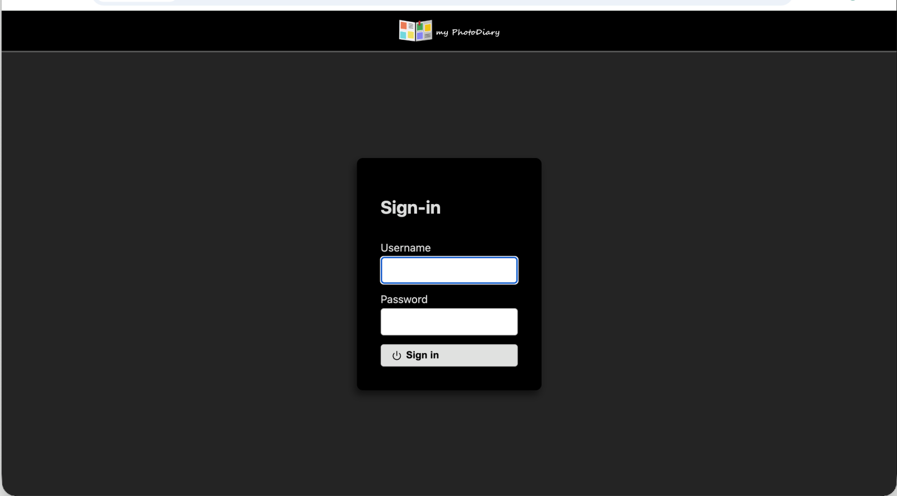
<figcaption>Sign-in screen, desktop</figcaption>
</figure>

The app automatically shows a different, purpose-built interface
depending on the device you're signing in from — a phone or tablet gets
a touch-first interface of its own (§9 onward), not just a resized copy
of the desktop screens covered in §2–§8. There's no setting to switch
between them manually; it's decided each time the app loads.

<figure>
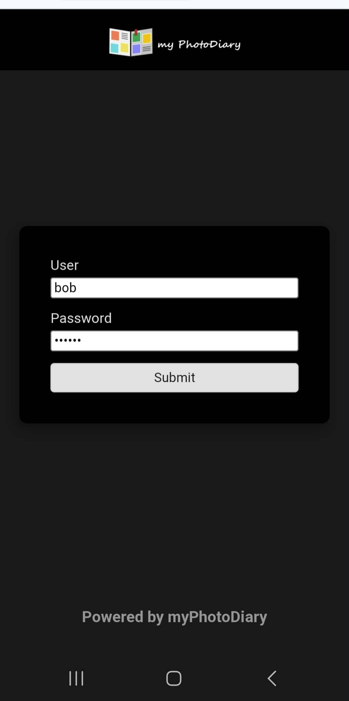
<figcaption>Sign-in screen, mobile</figcaption>
</figure>

## 2. Desktop: Gallery Screen

### 2.1 Layout: directory tree, viewer, and filmstrip

<figure>
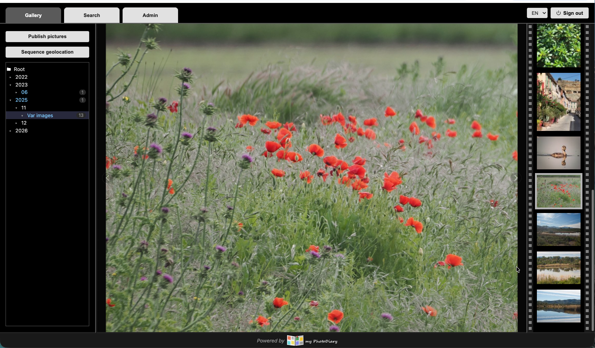
<figcaption>Gallery screen</figcaption>
</figure>

- **Left sidebar**: "Publish pictures" and "Sequence geolocation"
  buttons at the top (§3, §7); below them, the **directory tree** — your
  whole collection, organized as `year / month / sequence`. Click any
  row to expand it and jump straight to it, in one click. In the example above, the current sequence is 
  indexed as "2025/11/Var images" where **"Var images"** is the sequence name.

  The small number badge next to a row is how
  many pictures it directly contains: 13 images in "Var images". 
  Selecting a sequence that's never
  been browsed before indexes it automatically; there's nothing to do
  first.
- **Center**: the current picture, filling as much of the window as it
  can.
- **Right — the filmstrip**: every picture in the current sequence, one
  thumbnail per row, with the current one outlined in white. Click any
  thumbnail to jump straight to it; the strip scrolls and recenters on
  the current picture automatically as you move through the sequence.
  Plain gray tiles may fill out leftover space at the bottom of a short
  strip.
- **Top-right — the language selector**: the two-letter code (**EN** in
  the screenshot above) switches the whole interface between English,
  French, German, and Spanish. Your choice is remembered the next time
  you sign in. "Sign out" sits right next to it.
- **Bottom bar**: a thin band along the bottom of every screen, carrying
  the myPhotoDiary banner ("Powered by myPhotoDiary"). It's purely
  informative — nothing in it is clickable.

### 2.2 Hovering the picture: the control bar

<figure>
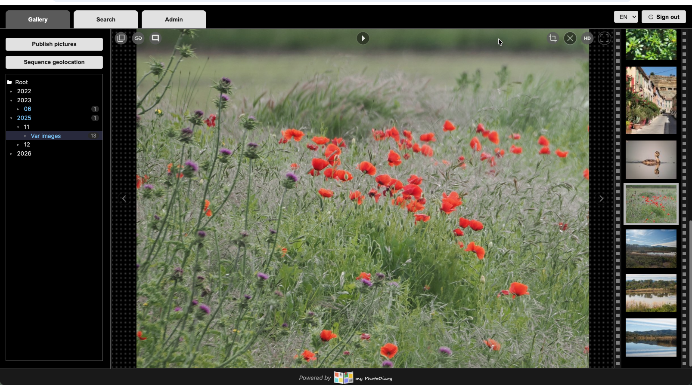
<figcaption>The control bar, revealed by hovering the top edge of the picture</figcaption>
</figure>

Move the mouse to the top edge of the picture to reveal the control bar,
plus the previous/next arrows at the picture's left and right edges.
From left to right:

<table>
<tr>
<td align="center" width="64"></td>
<td><b>Sequence link</b> — copies a share link to the <i>whole sequence</i> the current picture belongs to. See §6.</td>
</tr>
<tr>
<td align="center" width="64"></td>
<td><b>Picture link</b> — copies a share link to <i>this one picture</i>. See §6.</td>
</tr>
<tr>
<td align="center" width="64"></td>
<td><b>Comment</b> — shows the post-it with the sequence's and the picture's comments (§2.3), exactly as hovering it would; it fades out again after the usual delay.</td>
</tr>
<tr>
<td align="center" width="64"></td>
<td><b>Play</b> (in the middle) — starts a slideshow through the current sequence, advancing automatically; the button becomes Pause while it's running. The delay between pictures is a personal setting (§13).</td>
</tr>
<tr>
<td align="center" width="64"></td>
<td><b>Edit picture</b> — opens the picture editor: rotate, crop, or straighten the picture (§2.5). Not shown for a video, which can't be edited.</td>
</tr>
<tr>
<td align="center" width="64"></td>
<td><b>Delete</b> — deletes the current picture, after asking for confirmation. This cannot be undone.</td>
</tr>
<tr>
<td align="center" width="64"></td>
<td><b>HD</b> — shows the pictures at their <i>full resolution</i> instead of the lighter version used normally; the button turns white while HD is on. Click it again to go back. It stays on while you browse, until you click it again, leave the screen or reload the page. Full-resolution files are much heavier (often 5–20 MB), so each picture takes longer to appear on a slow connection, with a progress bar meanwhile. Not shown for a video.</td>
</tr>
<tr>
<td align="center" width="64"></td>
<td><b>Full-screen</b> — expands the picture to fill the whole browser window; the same button exits full-screen again.</td>
</tr>
<tr>
<td align="center" width="64"> </td>
<td><b>Previous / Next</b> (left/right edges of the picture) — previous/next picture in the current sequence, same as the ← and → arrow keys (§2.4).</td>
</tr>
</table>

### 2.3 Picture and sequence comments and tags

<figure>
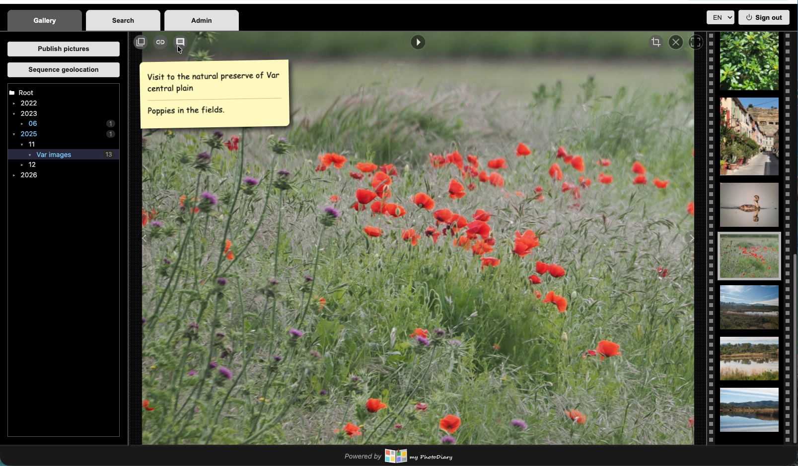
<figcaption>The post-it, showing both comments</figcaption>
</figure>

The **post-it** note over the picture holds two comments at once: the
current *sequence's* comment above the divider line, and the current
*picture's* own comment below it. It's hidden by default — hover it (or
click the **Comment** button of the control bar, §2.2) to reveal it
temporarily, or click it to keep it visible (pinned) until you move the
mouse away; either way it fades out again after a delay set in
Admin → Configure (§8.2). Click either half to open that comment for
editing.

<figure>
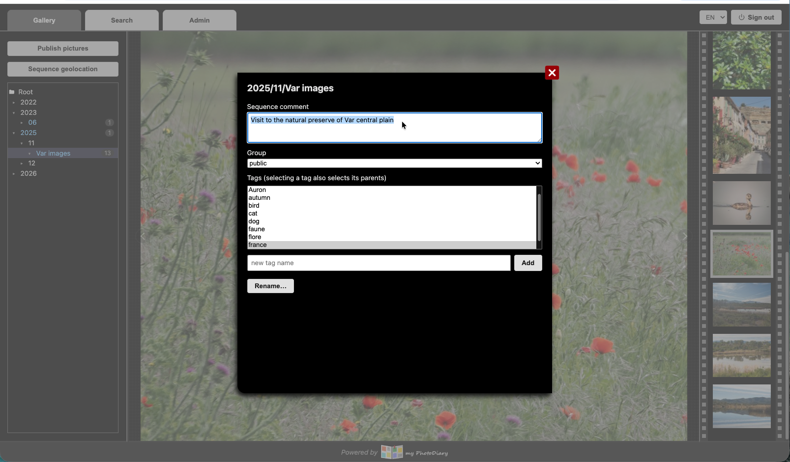
<figcaption>Editing a sequence's comment, group, and tags</figcaption>
</figure>

Clicking the **sequence** half opens this popup, titled with the
sequence's own path:
- **Sequence comment** — saved automatically as soon as you click
  outside the field, no separate save button.
- **Group** — only shown if you're allowed to move this sequence to a
  different group at all (§8.1); moves the whole sequence, with
  everything in it, to whichever group you pick.
- **Tags** — see below.
- **Rename…** — reveals two fields, filled in with the sequence's
  current **Name** and **Date** (`MM/YYYY`, the month and year it's filed
  under). Change either one or both, then **Save**:
  - a new name renames the sequence; the name is a single name: it can't
    contain `/` or `\`, nor start with a dot;
  - a new date moves the whole sequence, with all its pictures, to that
    month in the `year/month/sequence` tree — for instance when a
    camera's clock was wrong. If its old month or year is left empty,
    it disappears from the tree.

  A date that isn't `MM/YYYY` (a month from 01 to 12 — `8/2026` is fine
  too) shows an error and nothing is moved, as does a sequence with the
  same name already in the target month. Moving doesn't change the
  pictures' own capture dates (recorded by the camera). The Date field
  only appears for a sequence filed as `year/month/name`.

<figure>
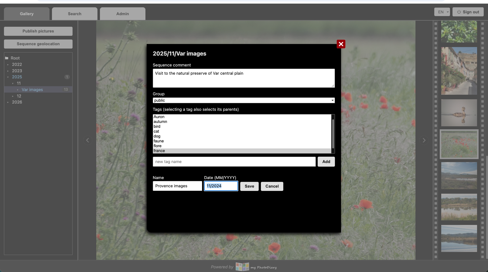
<figcaption>Renaming a sequence and moving it to another month</figcaption>
</figure>

In this example, saving would rename `2025/11/Var images` to
`Provence images` and move it to November 2024 in one step: the
sequence becomes `2024/11/Provence images`. **Cancel** hides the two
fields again without changing anything.

> **About groups**: by default, every user and every picture sequence
> belongs to the same single group, `public` — and we recommend leaving
> it that way unless you have a specific reason not to; it's the
> simplest setup and needs no thought from anyone. Groups are a more
> advanced topic: they let you segment your audience, restricting a
> subset of users to a subset of sequences. For example, you could
> create a separate group for a one-off event like a wedding, and admit
> a wider circle of people to view and contribute pictures to *that*
> group specifically, without giving them access to the rest of your
> collection. See §8.1 for creating groups and assigning people to them.

<figure>
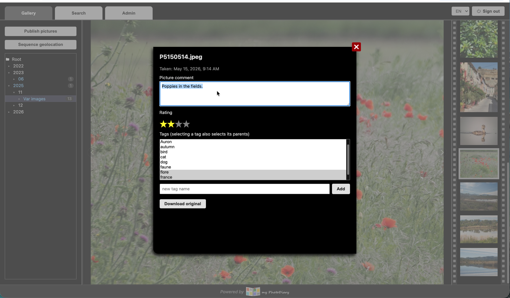
<figcaption>Editing a picture's comment, rating, and tags</figcaption>
</figure>

Clicking the **picture** half opens this popup instead, titled with the
picture's own filename and, if known, when it was taken:
- **Picture comment** — same auto-save-on-click-away behavior as the
  sequence comment above.
- **Rating** — click a star to rate the picture 1 to 4; saved
  immediately.
- **Tags** — see below.
- **Download original** — saves this one picture's full-resolution
  original to your computer.

**Tags**, on both popups: a multi-select list — Ctrl/Cmd-click to pick
more than one. Selecting a tag automatically selects its parent tags too
(so picking "cat" under "Fauna" also tags the picture or sequence
"Fauna"). To create a brand-new tag on the spot instead of picking an
existing one, type its name in the field below the list and click
**Add** — it's created and assigned in one step, without leaving this
popup. (Managing the tag tree itself — renaming, deleting, or
reorganizing tags — is done from Admin → Tags instead, §8.4.)

### 2.4 Tips and keyboard shortcuts

These work anywhere the picture viewer is showing — Gallery (§2) and
Search (§5) alike — as long as focus isn't sitting in a text field, and
as long as no popup (§2.3, §2.5, §7, or any Admin form) is currently open;
close whatever's open first if a shortcut doesn't seem to do anything.

| Key | Does the same as |
|---|---|
| ← | The **‹** arrow (§2.2) — previous picture |
| → | The **›** arrow (§2.2) — next picture |
| ↓ | The **Play**/Pause button (§2.2) — starts or stops the slideshow |
| Escape | Exiting full-screen (§2.2) — only if already in full-screen; it never *enters* full-screen |
| ↑ | Exits full-screen first if it was active, then moves up to the current sequence's parent directory in the tree |

One difference worth knowing: **↑** only moves up the tree on the
Gallery screen — Search has no directory tree position to move "up"
from, so there it only ever exits full-screen, without navigating
anywhere.

### 2.5 Editing a picture: rotate, crop, transform

<figure>
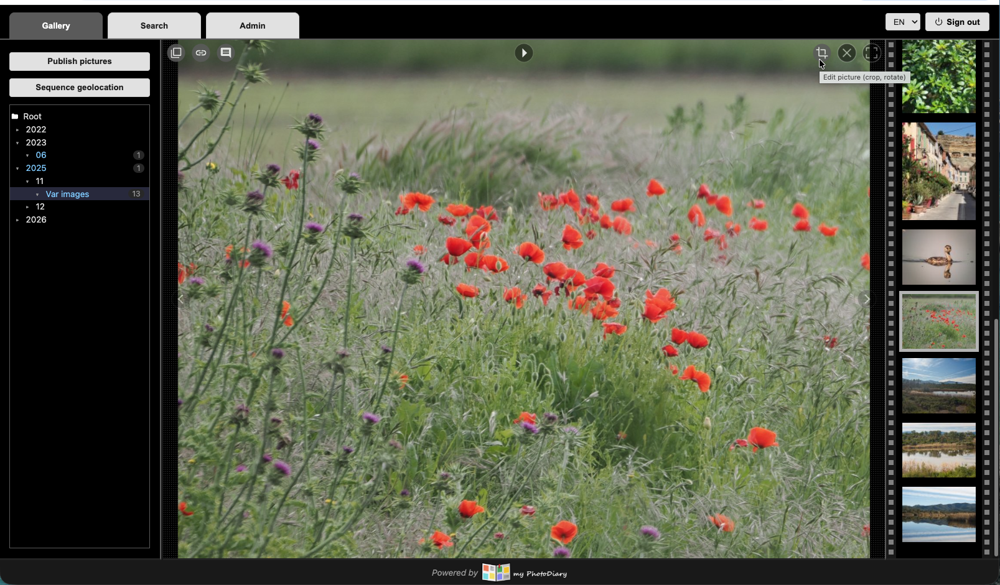
<figcaption>The Edit picture button in the control bar</figcaption>
</figure>

<figure>
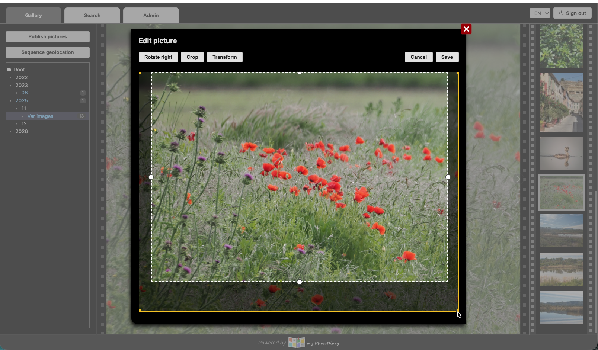
<figcaption>The picture editor, with the crop rectangle and the four transform corners</figcaption>
</figure>

The **Edit picture** icon (§2.2) opens the picture at full resolution in
an editor popup. Three buttons on the left, **Cancel** and **Save** on
the right:

- **Rotate right** — turns the picture 90° clockwise. Click it several
  times in a row to turn it 180° or 270°; four clicks bring it back to
  where it started. Rotating never loses anything, so you can click it
  as often as you like before deciding.
- **Crop** — keeps only the area inside the dashed rectangle. Drag the
  four round handles in the middle of its edges to resize it first.
- **Transform** — straightens something photographed at an angle (a
  document, a painting, a building's front). Drag the four square corner
  handles onto the four corners of the area that should end up
  rectangular; the result is stretched to the size of the crop
  rectangle.

Each of these only shows you a **preview** first — nothing is changed
yet. Then:
- **Save** applies it for good, to the picture itself and to all its
  sizes (thumbnail included). The editor stays open, so you can chain
  several edits.
- **Cancel** throws the preview away and returns to the picture as it
  was (for Rotate, the whole series of clicks at once). With no preview
  showing, Cancel closes the editor.

While a preview is showing, Crop and Transform are disabled until you
Save or Cancel it (Rotate stays available during its own series of
clicks, but not during a Crop or Transform preview) — pending edits are
never stacked on top of each other. A saved crop or
transform can't be undone afterwards: the removed or reshaped part of
the picture is gone.

## 3. Desktop: Uploading Pictures and Videos

<figure>
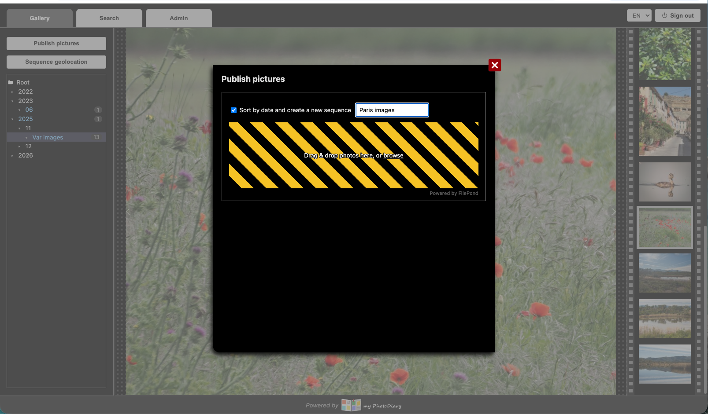
<figcaption>Publish pictures popup</figcaption>
</figure>

Click **Publish pictures**, above the directory tree, to open this
popup. Drag pictures and short videos onto the striped area, or click
**browse** to pick them from a file dialog instead — both photos and
MP4 (H.264) videos are accepted; there's a maximum video size an
administrator sets for the whole instance (§8.2).

One checkbox decides where an uploaded file ends up:

- **Sort by date and create a new sequence** (checked by default), with
  a sequence name field next to it — each file's own capture date decides
  its `year/month` folder, and the files land in a new
  `year/month/sequence-name` sequence under it. Because the date is read
  per file, two pictures dropped in together can legitimately land in
  different months if the batch happens to straddle one (you then get
  one sequence with the same name in each month).
- Unchecked, the label turns into **Store photos in:** followed by the
  sequence currently selected in the directory tree (or **Root**) — every
  file goes straight there, with no date sorting and no new sequence.

**On a slow connection, photos are made smaller automatically before
they're sent**, so a batch doesn't take forever over a mobile hotspot or
a weak Wi-Fi. There's nothing to switch on: the browser measures how
fast your uploads actually go and, only when a photo would take longer
than a target set by an administrator (§8.2, 10 seconds by default),
scales it down just enough — never below 2400 pixels on its long side.
On a normal connection, nothing is changed. A few things to know:
- In case of slow network, the reduced photo **replaces** the original 
  on the server: it's what
  everyone sees, what gets backed up, and what the editor works on.
  Upload from a fast connection when you want to keep full resolution.
- Only JPEG photos are made smaller. PNG files and videos are always
  sent as they are. If your photo software exports PNG (common with raw
  developers), exporting JPEG at a high quality instead (90–95) gives
  much smaller files with no visible difference.
- The capture date and GPS location recorded by the camera are kept.
- The first photo or two of a batch may start at full size while the
  speed is still being measured; if the connection turns out to be slow,
  they're restarted in the smaller size after a few seconds.

Close the popup with the **✕** in its top-right corner once you're done.
Uploaded files appear in the gallery straight away, and the directory
tree expands on its own to show wherever they actually landed — worth
checking if "Sort by date" was on and you're not sure which month a
picture's own camera stamped it with.

> _For importing everything already sitting in a whole external folder
> at once (e.g. emptying a memory card), rather than a few files by
> hand, see "Batch publish" in §8.3 instead — a separate feature, for a
> different scale of import._

## 4. Desktop: Tags

A **tag** is a free-form label you attach to a sequence or a picture —
a subject, a place, a person, a theme, anything you like — independent
of where it happens to sit in the `year/month/sequence` tree. The
`year/month/sequence` hierarchy answers "when and in which trip was
this taken"; tags answer "what's actually in it", and the same tag can
apply to pictures scattered across many unrelated sequences and dates.

What they're good for is mainly **finding things again later**: search
by tag (§5) to pull up every picture and sequence tagged e.g. "dog" or
"wedding", regardless of when or where they were taken, without having
to remember or browse to the right folder. Tags can also be organized
into a parent/child tree (e.g. 
"Fauna" → "Dog"/"Cat") — tagging something with a specific child tag
also tags it with every ancestor automatically, so searching the broad
parent tag ("Fauna") still finds it, without having to tag
everything twice at both levels.

Assigning tags to a picture or a sequence — including creating a
brand-new tag on the spot — is covered together with comments in §2.3,
right where those fields actually live. Managing the tag tree itself
(creating, deleting, and reorganizing tags by drag-and-drop) is covered
in §8.4, Admin → Tags.

<figure>
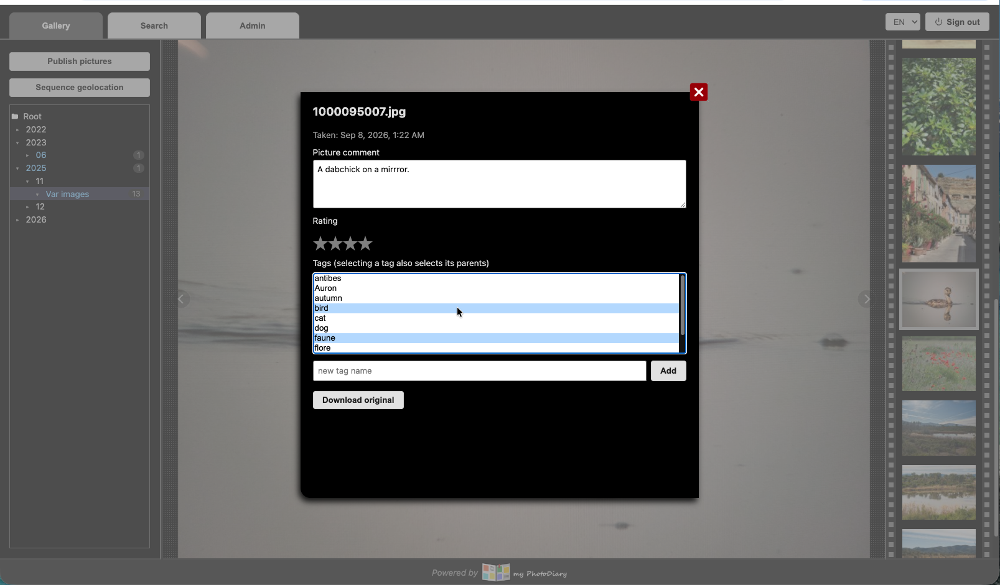
<figcaption>Assigning tags to a picture, from its comment popup</figcaption>
</figure>

## 5. Desktop: Search Screen

<figure>
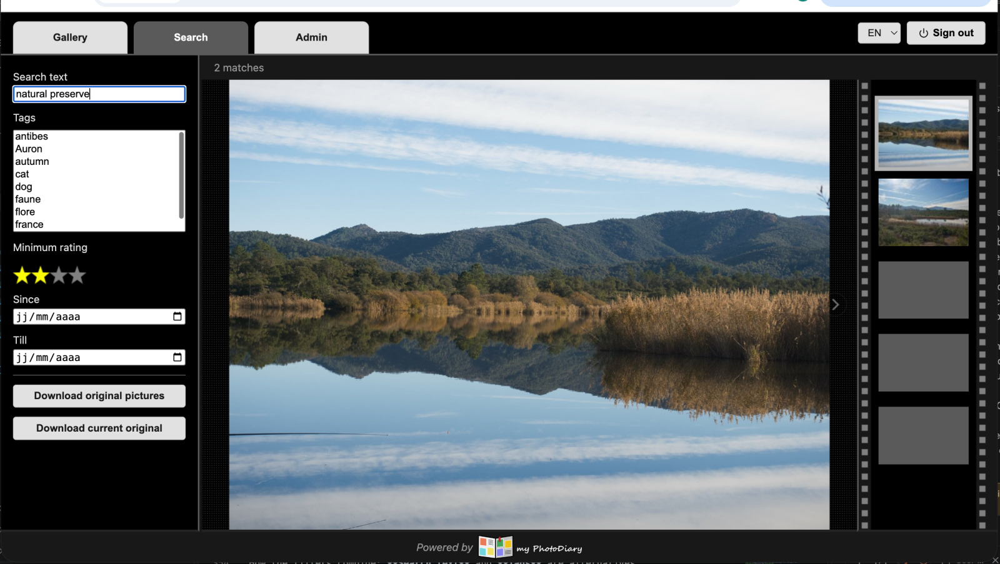
<figcaption>Search screen</figcaption>
</figure>

Filters live in the sidebar; results are browsed with the exact same
viewer and filmstrip as the Gallery screen (§2) — Search doesn't have a
separate results grid of its own.

- **Search text** — matches a sequence's own name, its comment, or the
  current picture's comment. At least 4 characters; anything shorter is
  ignored entirely.
- **Tags** — the same multi-select as a sequence's or a picture's own
  tags (§2.3); Ctrl/Cmd-click to pick more than one.
- **Minimum rating** — click a star to require at least that rating;
  click the same star again to go back to "any rating".
- **Since / Till** — a capture-date range, using your browser's own
  native date picker.

How the filters combine: **Search text** and **Tags** are alternatives
to each other — a picture matches if *either* one matches, not only if
both do. **Minimum rating** and the date range then narrow that result
further, on top of the text/tags match. Leave every filter empty and
nothing is searched at all.

Above the picture, the match count ("1 match" in the screenshot above)
shows how many pictures the current filters found. The viewer itself
works like the Gallery screen (§2.2), with its own set of buttons in the
control bar, from left to right:
<table>
<tr>
<td align="center" width="64"></td>
<td><b>Go to this sequence in Gallery</b> — jumps straight into normal browsing, at that exact picture, in its real place in the directory tree.</td>
</tr>
<tr>
<td align="center" width="64"></td>
<td><b>Search result link</b> — same icon as the Gallery's sequence link: copies a link to <i>the whole search result</i>. See §6.</td>
</tr>
<tr>
<td align="center" width="64"></td>
<td><b>Picture link</b> — copies a link to the picture currently displayed. See §6.</td>
</tr>
<tr>
<td align="center" width="64"></td>
<td><b>Play</b> (in the middle) — starts a slideshow through the search result, as in the Gallery (§2.2).</td>
</tr>
<tr>
<td align="center" width="64"></td>
<td><b>HD</b> — shows the pictures at full resolution until clicked again, as in the Gallery (§2.2). Not shown for a video.</td>
</tr>
<tr>
<td align="center" width="64"></td>
<td><b>Full-screen</b> — expands the picture to fill the whole browser window; the same button exits full-screen again.</td>
</tr>
<tr>
<td align="center" width="64"> </td>
<td><b>Previous / Next</b> (left/right edges of the picture) — previous/next picture of the search result, same as the ← and → arrow keys (§2.4).</td>
</tr>
</table>

The Comment button, the picture editor, and Delete are on the Gallery
screen only (§2.2).

Two buttons below the filters download original pictures straight to a
folder you choose:
- **Download original pictures** — every picture currently matching the
  filters, not only the ones already scrolled past in the filmstrip.
- **Download current original** — just the picture currently displayed.

Both need a Chromium-based browser (Chrome or Edge) and a secure
context (HTTPS, or `localhost`) — the underlying browser feature that
lets a web page save straight into a folder you pick isn't available
anywhere else. On another browser, the buttons show an error instead of
silently doing nothing.

## 6. Desktop: Sharing a Picture, a Sequence or a Search Result

The share buttons are at the left of the control bar (hover the top
edge of the picture, §2.2):
- on the **Gallery** screen, the **first** one copies a link to the
  *whole sequence* the current picture belongs to;
- on the **Search** screen (§5), the same icon copies a link to *the
  whole search result* instead;
- on both, the chain-link icon copies a link to *just the picture
  currently displayed*.

Paste either link anywhere (an email, a message) and send it to anyone —
they don't need a myPhotoDiary account, or even to be one of this
instance's own users. In messaging apps such as WhatsApp, the link shows
a preview card with the picture itself (the first picture, for a
sequence link) rather than a generic icon.

<figure>
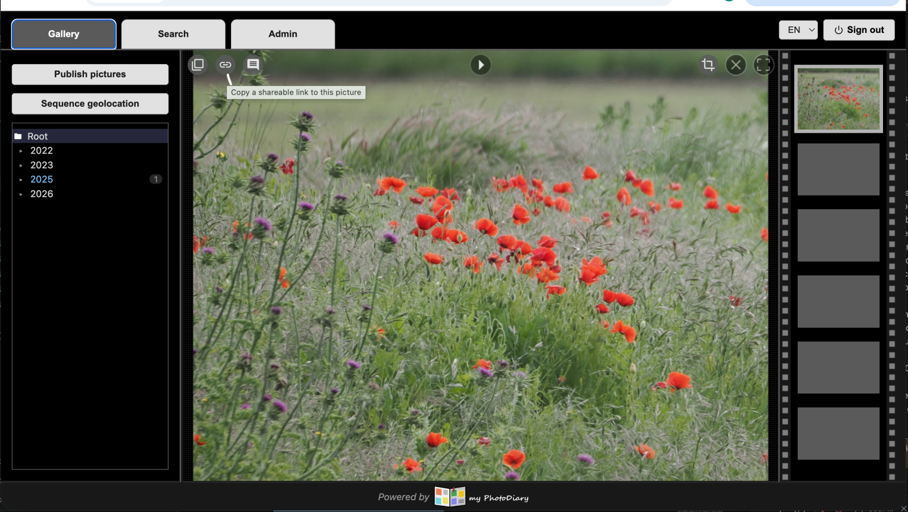
<figcaption>What a single-picture link shows</figcaption>
</figure>

A **picture link** opens to exactly that one picture: the same banner as
the rest of the app, but no tabs, no sidebar, and no filmstrip — there's
nothing else to browse to.

<figure>

<figcaption>What a sequence link shows</figcaption>
</figure>

A **sequence link** instead opens the whole sequence, with its own
filmstrip and Previous/Next arrows — browsable just like the Gallery
screen (§2.1), minus the directory tree around it.

A **search result link** opens the same way, with the pictures of the
search result instead of one sequence's. A few things to know about it:
- **It's a snapshot.** The link shows the pictures your search found at
  the moment you created it, in the same order. A picture added later
  that would match the same search doesn't appear; a picture deleted
  since simply disappears from it. If every picture has been deleted,
  the link says so.
- **It holds at most 50 pictures** (an administrator can change this
  number, §8.2). For a larger result, the first 50 are shared and a
  yellow warning tells you how many of how many went out — refine the
  search if you want to share a precise selection.
- Each picture's post-it shows *its own* sequence's comment, since the
  pictures of a search result usually come from different sequences.

Either way, the recipient gets a **read-only** viewer: hovering the
picture still reveals Play and Full-screen (§2.2), and the post-it
comment (§2.3) still shows and can still be hovered or pinned open —
but there's no share, edit, or delete icon, and clicking the post-it
doesn't open anything to edit.

A few things worth knowing before sending a link:
- It stays valid for **30 days** from the moment you copy it, then
  simply stops working — the same "This link is invalid or has
  expired." message shows for a mistyped link, an expired one, and one
  whose picture or sequence has since been deleted, so there's no way
  to tell those apart from the recipient's side.
- There's no way to revoke a link early once it's been sent, short of
  deleting the picture or sequence itself — if you shared the wrong
  thing, treat the link as compromised for the rest of its 30 days.
- **Videos can't be shared.** A picture link can't be created for a
  video at all, and sequence and search result links simply leave any
  videos out of what the recipient sees.

## 7. Desktop: Sequence Geolocation

<figure>
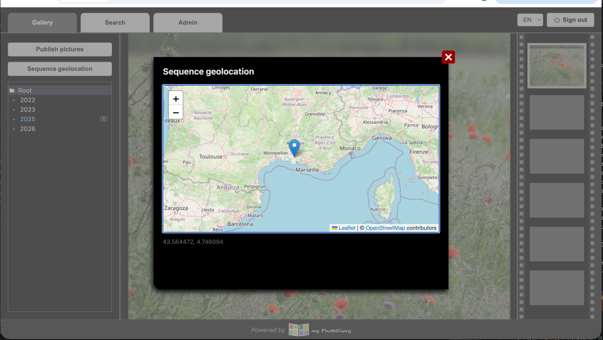
<figcaption>The sequence geolocation map, with the sequence's pin</figcaption>
</figure>

Click **Sequence geolocation**, above the directory tree, to place the
current sequence on a map (an OpenStreetMap map — nothing to configure,
no account needed):

- The **large pin** is the sequence's own location. **Drag it** to where
  the sequence was taken; the new position is saved as soon as you drop
  it, and its coordinates are shown under the map.
- **Small blue dots** are the pictures of this sequence that carry a GPS
  position recorded by the camera or phone. They're only there to guide
  you — they can't be moved, and pictures without GPS simply have no dot.
- Where the pin starts: at the sequence's saved location if it has one;
  otherwise at the average position of those GPS dots; otherwise at your
  default map position (§8.2).

Nothing is saved just by opening the map — only dragging the pin saves a
location. Close the popup with the **✕** in its top-right corner.

## 8. Desktop: Admin Screen

The **Admin** tab isn't only for Admins: an Admin sees all five
sub-tabs below; a Writer sees a single, reduced Configure tab — just
their own personal settings (§8.2, §13), nothing else. Reader and Lower
don't see the Admin tab at all.

### 8.1 Users

<figure>
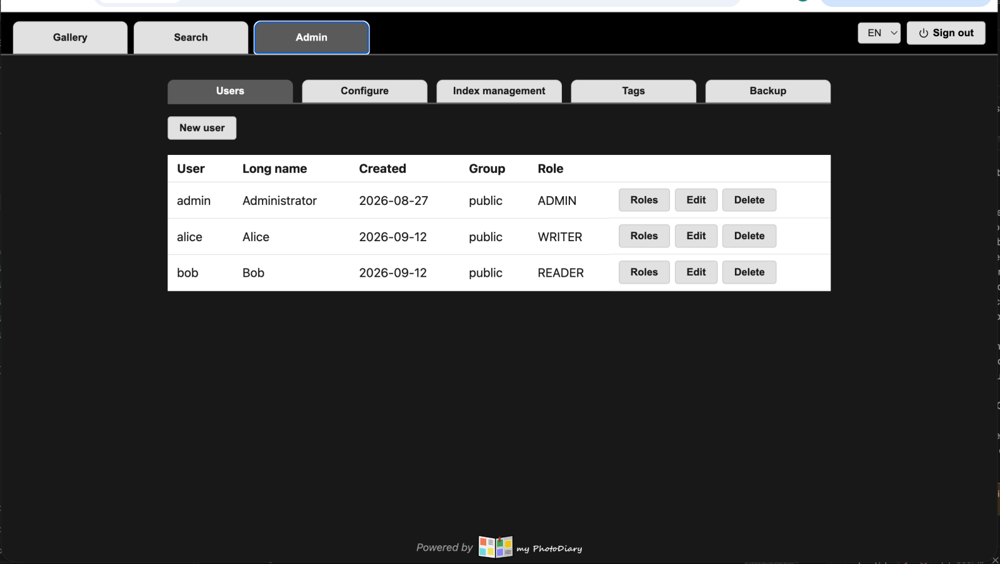
<figcaption>Users tab</figcaption>
</figure>

The user table: username, long name, creation date, primary group, and
primary role. **New user** opens the same form as **Edit** below, with
two extra fields — Username, and a Primary group (defaults to `public`
if left blank).

<figure>
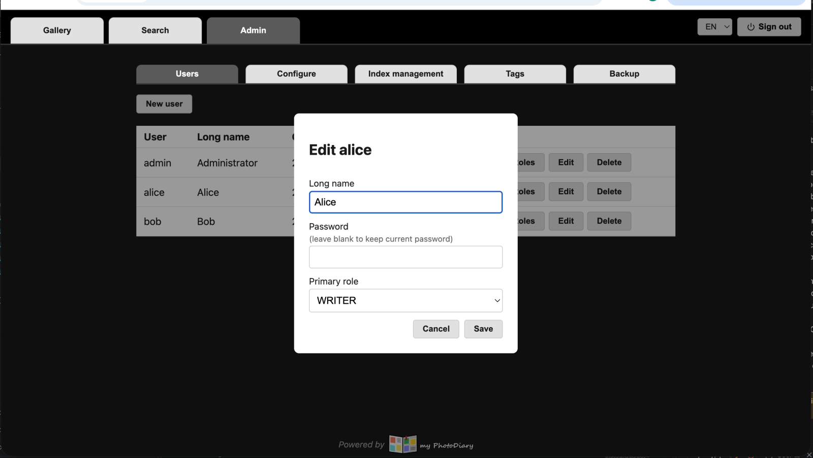
<figcaption>Editing a user</figcaption>
</figure>

**Edit** changes a user's long name, primary role, and optionally their
password — leave the password field blank to keep the current one.
**Delete** removes the account itself; it never touches any picture or
sequence, which belong to a group, not to a particular user.

<figure>
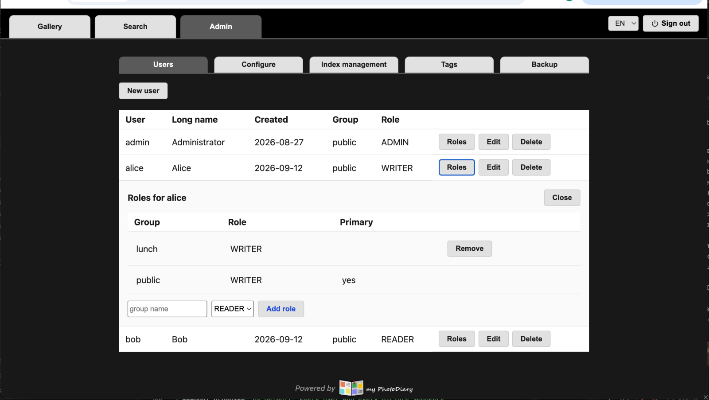
<figcaption>Managing a user's role assignments</figcaption>
</figure>

**Roles** opens a per-user panel of **group / role** pairs. A user can
hold a different role in more than one group at once, and exactly one of
those assignments is marked **primary** — their default role, and the
one that decides whether they're treated as a global Admin (see below).
Type a group name and pick a role to add another assignment — a group
name that doesn't exist yet is simply created. A non-primary row can be
removed with its own button; the primary one can't be removed directly
(change it, or make a different row primary first).

> **About groups**: by default, every user and every picture sequence
> belongs to the same single group, `public` — and we recommend leaving
> it that way unless you have a specific reason not to; it's the
> simplest setup and needs no thought from anyone. Groups are a more
> advanced topic: they let you segment your audience, restricting a
> subset of users to a subset of sequences. For example, you could
> create a separate group for a one-off event like a wedding, and admit
> a wider circle of people to view and contribute pictures to *that*
> group specifically, without giving them access to the rest of your
> collection — typing a group name that doesn't exist yet, either here
> or in the sequence's own **Group** field (§2.3), creates it on the
> spot.

What each role allows, within the group it's assigned to:
- **Admin** — full control: publish, edit, delete, reassign, manage
  everything in that group.
- **Writer** — can publish (including into a brand-new sequence) and
  edit existing pictures and sequences (comment, tag, rate, and the
  picture editor's rotate/crop/transform), but can't delete a picture or
  a sequence.
- **Reader** and **Lower** — read-only browsing; the two currently
  behave identically.

One thing worth knowing when assigning roles: Admin only grants full
access **everywhere** when it's the account's **primary** role. An Admin
role assigned to a group that isn't that user's primary one only grants
full control within that one group, same as any other role would.

### 8.2 Configure

<figure>
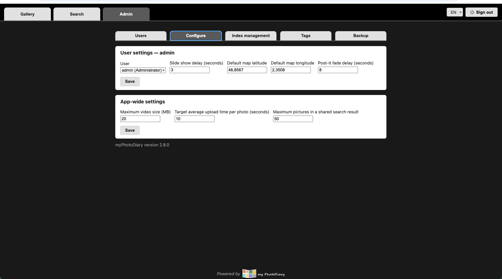
<figcaption>Configure tab</figcaption>
</figure>

Two independent forms:
- **User settings** — slideshow delay (§2.2), default map position for
  a sequence with no location of its own (§7), and how long the post-it
  comment stays visible after you stop hovering it (§2) — for one user
  at a time. An Admin gets a picker to choose which user (defaulting to
  themselves); a Writer only ever sees and edits their own, with no
  picker at all (§13).
- **App-wide settings** — for the whole instance, Admin-only (a Writer
  doesn't see this box at all):
  - **Maximum video size (MB)** — larger videos are refused at upload.
  - **Target average upload time per photo (seconds)** — how long a
    photo upload is allowed to take before photos are automatically made
    smaller on a slow connection (§3). A lower value means faster uploads
    on slow networks but smaller stored photos; a higher value keeps more
    resolution. 10 seconds by default.
  - **Maximum pictures in a shared search result** — above it, only the
    first ones are shared, with a warning to the person sharing (§6).
    50 by default.

Under these two boxes, a line shows the **version of myPhotoDiary
running on the server** — useful to check that an upgrade really took
effect.

### 8.3 Index management

<figure>
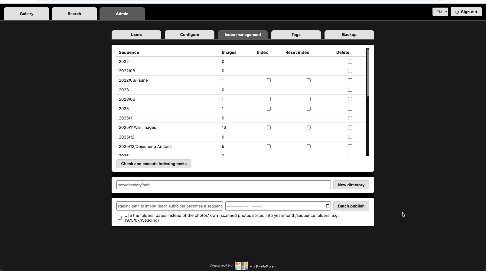
<figcaption>Index management tab</figcaption>
</figure>

Three independent tools, stacked top to bottom:

- **The directory table** — every sequence, with checkboxes for
  **Index** (scan disk and sync the database with what's actually
  there — offered wherever the folder has at least one file on disk),
  **Reset index** (remove from the database only, files on disk are
  left untouched — offered only once a sequence is already indexed),
  and **Delete** (remove from the database *and* permanently delete the
  files). Tick as many boxes across as many rows as needed, then
  **Check and execute indexing tasks** — it asks for confirmation first,
  then runs every deletion, then every reset, then every (re)index, in
  that order.
- **New directory** — creates an empty sequence at the given
  `year/month/sequence` path, both in the database and as a real folder
  on disk, ready to receive pictures.
- **Batch publish** — imports everything already sitting in an external
  staging folder on the server (e.g. a mounted memory card), sorted by
  EXIF date exactly like a normal publish (§3), with each picture's own
  folder name becoming its sequence name. Files are copied: the staging
  folder is left untouched, and running it again on the same folder
  doesn't duplicate anything. Files and folders whose name starts with a
  dot are ignored. The month field next to it is only a fallback, used
  solely for a file with no EXIF or WhatsApp-style date of its own — it
  never changes a picture's real date. This needs the server's staging
  location configured first — see the Installation Guide.

  **Old photos scanned years later** have no usable date of their own
  (their EXIF and file dates are the scanning date). Sort them by hand
  into `year/month/sequence` folders in the staging folder — for example
  `1975/07/Wedding/scan001.jpg` — and tick **"Use the folders' dates
  instead of the photos' own"**: each picture then takes the year and
  month of its folder (stored as the last day of that month, since the
  day isn't known) and lands in that same `year/month/sequence` in the
  tree. Any file not placed exactly that way is listed as a failure and
  not imported. The month field doesn't apply in this mode.

### 8.4 Tags

<figure>
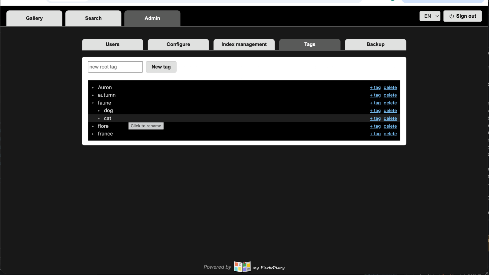
<figcaption>Tags tab</figcaption>
</figure>

The full tag tree (§2.3 covers assigning tags to a picture or a sequence —
this tab manages the tags themselves):
- **New tag**, at the top, creates a new top-level tag.
- **+ tag**, next to any tag, opens a small inline form to add a *child*
  tag under it.
- **delete** removes a tag; any children it had move up to become
  children of its own parent instead (or top-level tags, if it had
  none) — nothing is ever deleted in cascade.
- **Drag and drop** a tag onto another one to make it that tag's child;
  drop it onto the black background instead to detach it back to the
  top level.

### 8.5 Backup

<figure>
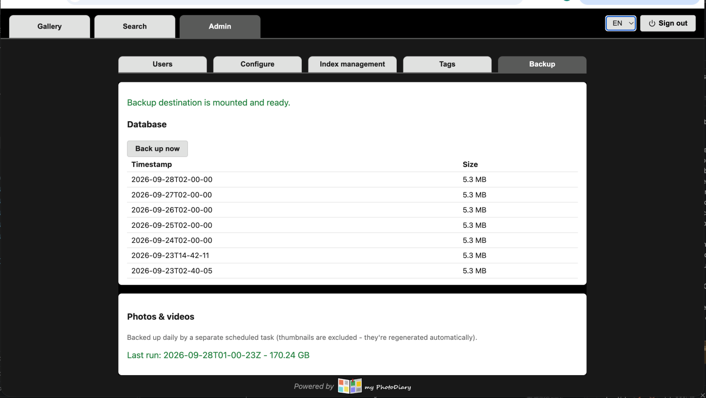
<figcaption>Backup tab</figcaption>
</figure>

Admin-only — a Writer doesn't see this tab at all, even in their reduced
Admin screen (§8.2). Two independent halves, shown top to bottom, both
read-mostly: this screen reports on backups, it doesn't restore them (see
below for why).

A status line at the top reads either "backup target mounted and ready"
or a warning that it isn't — the second is entirely normal on an instance
where an administrator hasn't set up a backup destination yet; nothing
else on this tab does anything useful until that's done (see the
Installation Guide's own Backup and Restore chapter for setting one up).
On an instance that uses a marker file on the backup destination (always
the case with the Docker image), the warning can instead say that this
marker file is missing: the destination isn't mounted, or the file
hasn't been created on it yet.

- **Database** — a table of nightly snapshots (timestamp and size), taken
  automatically in the background. **Back up now** triggers an extra one
  immediately, useful right before a risky change; the table refreshes
  once it finishes, with a success or failure message shown underneath
  the button either way.
- **Original photos and videos** — a read-only summary of the most recent
  run of the separate, daily image-tree backup: when it last ran, whether
  it succeeded, and its size (or the failure message, if it didn't).
  There's no button here — this half runs on its own fixed daily schedule
  on the server, independent of this screen, and thumbnails/derivatives
  are deliberately left out of it (they're regenerated automatically by
  re-indexing, §8.3).

**Restoring is a server administrator's job, not a click on this
screen** — on purpose: an accidental one-click restore could silently
overwrite months of real pictures or the entire user database with an
old snapshot. It's done from a terminal on the server itself, with a
dry-run shown by default before anything is actually overwritten — see
the Installation Guide's **Backup and Restore** chapter for the exact
commands, including how to rehearse a restore safely against a scratch
copy first, without touching your real data at all.

## 9. Mobile: Getting Around

### 9.1 The four corner buttons

This is the **mobile home screen** — an empty screen is shown here, as the first time you connect to the application. We recommend to upload a welcome image (§3) into the **home screen** with a welcome comment.

<figure>
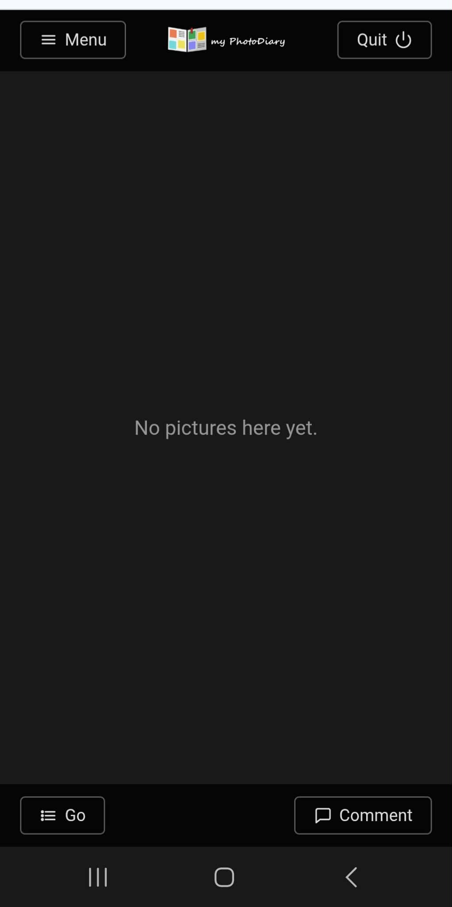
<figcaption>The mobile home screen, with no picture loaded so all four corner buttons show clearly</figcaption>
</figure>

You can see the
four corner buttons stand out clearly against a
plain background. They're visible by default as soon as you sign in, and
double-tapping the picture hides and reveals them again from there
(§10):

- **Menu** (top-left) — opens the hamburger menu (§9.3).
- **Quit** (top-right) — signs out.
- **Go** (bottom-left) — opens the navigation panel (§9.2).
- **Comment** (bottom-right) — shows or hides the post-it note over the
  picture; tapping into the note itself to actually edit a comment
  works the same as on desktop (§2.3, §10).
- **Share** (bottom-center) — shares the current picture or sequence
  (§9.4).

### 9.2 The "Go" navigation panel

Tapping **Go** slides in a single-level browser: the current path
(e.g. "2025/11/…") heads the list, followed by everything directly
inside it. Tap an entry to go into it:
- If it's a level with pictures of its own (a real sequence, "Var
  central" above), it becomes the current sequence right away — the
  picture behind the panel updates immediately, even while the panel
  stays open.
- If it's just an intermediate level with no pictures of its own (a
  bare year or month), the list simply refreshes in place to show
  what's one level deeper — it doesn't close on you with nothing to
  show.

<figure>
<table>
<tr>
<td align="center" width="220">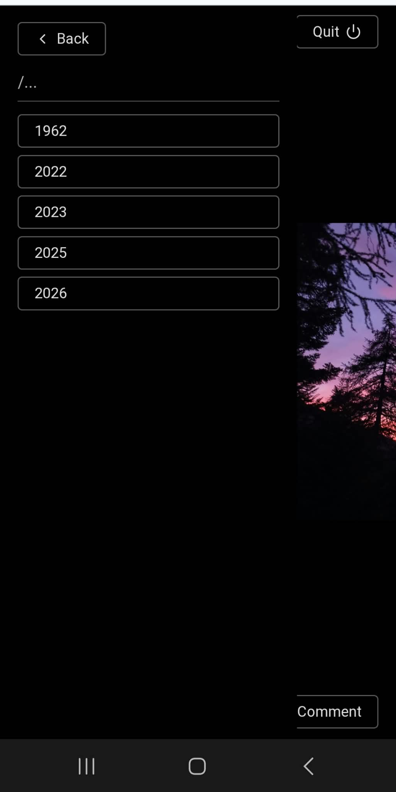</td>
<td align="center" width="30">➜</td>
<td align="center" width="220">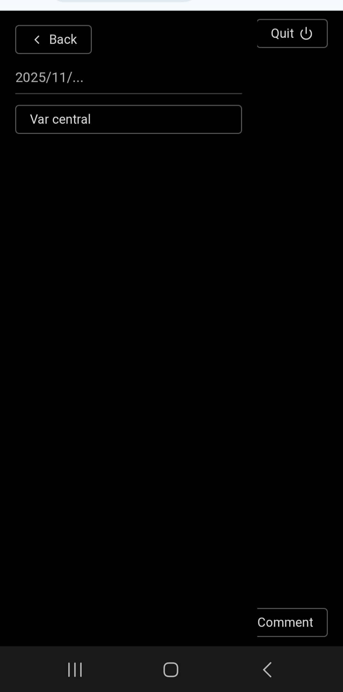</td>
<td align="center" width="30">➜</td>
<td align="center" width="220">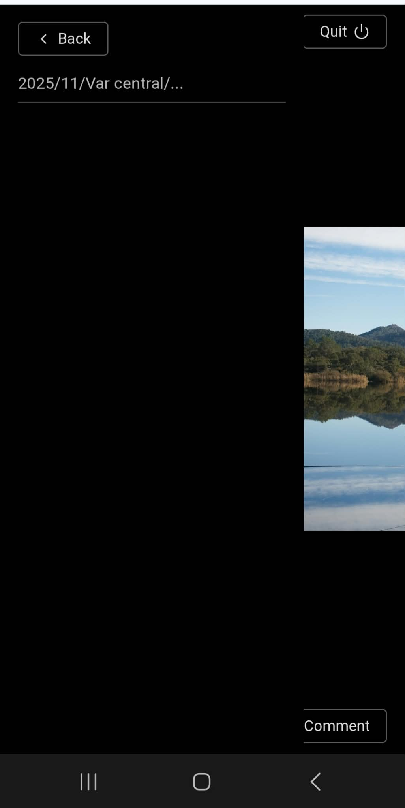</td>
</tr>
<tr>
<td align="center" width="220">Top level</td>
<td width="30"></td>
<td align="center" width="220">A month, one level down</td>
<td width="30"></td>
<td align="center" width="220">Inside a sequence — the picture behind updates</td>
</tr>
</table>
<figcaption>Navigating through the Go panel</figcaption>
</figure>

**Back** goes up one level (disabled at the very top). The panel never
closes itself just because you selected something — browse through
several sequences in a row without having to reopen Go each time. To
actually get back to looking at the picture, double-tap it or swipe
it (§10) — the same gesture that hides/reveals the corner buttons
elsewhere also closes whichever panel is open.

### 9.3 The hamburger menu

<figure>
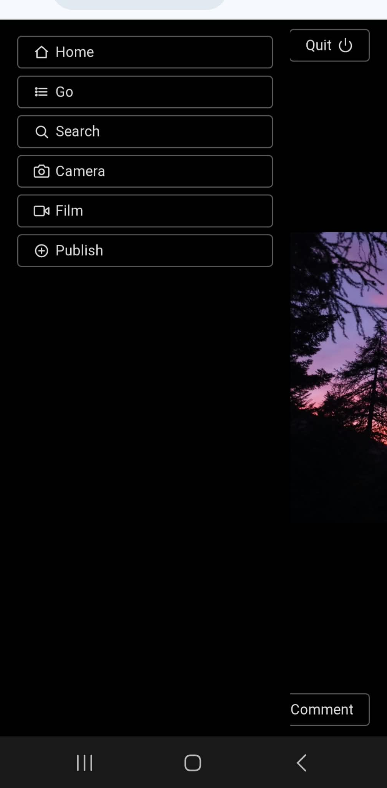
<figcaption>The hamburger menu</figcaption>
</figure>

Tapping **Menu** instead slides in six entries:
- **Home** — closes the menu and returns to the home screen (also gets
  you out of any full-screen page below, if one is open).
- **Go** — switches straight to the navigation panel above (§9.2).
- **Search** — the mobile search form (§12).
- **Camera** / **Film** — launch the device's camera directly, for a
  photo or a video respectively (§11).
- **Publish** — the same picture/video upload flow as Go's own
  destination picker feeds into (§11).

There's no "Quit" entry here — it would only duplicate the header's own
Quit button, which stays reachable regardless of which panel is open.

### 9.4 Sharing

Tapping **Share** button in the bottom control bar opens a small popup 
with two choices: **Share current
image** or **Share current sequence**. Either one creates the same kind
of 30-day link as on desktop (§6) and hands it straight to your phone's
own share sheet — pick WhatsApp, Messages, email, or any other app from
there. On a browser that has no share sheet, the link is copied to the
clipboard instead, and a "Link copied!" message confirms it. Videos
can't be shared (§6), so **Share current image** is disabled while a
video is showing.

While you're browsing a **search result** (§12), the second choice
becomes **Share search result**: it shares the whole result, with the
same rules as on desktop (§6) — a snapshot of at most 50 pictures. When
the result was larger, the popup stays open after sharing and shows a
warning with how many pictures were actually shared.

<figure>
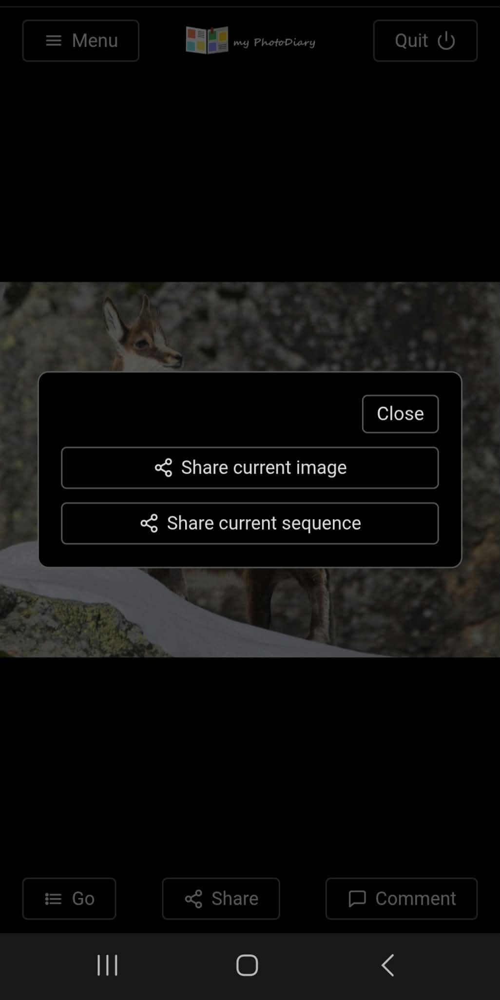
<figcaption>The Share popup</figcaption>
</figure>

## 10. Mobile: Viewing Pictures

### 10.1 Single-picture view

<figure>
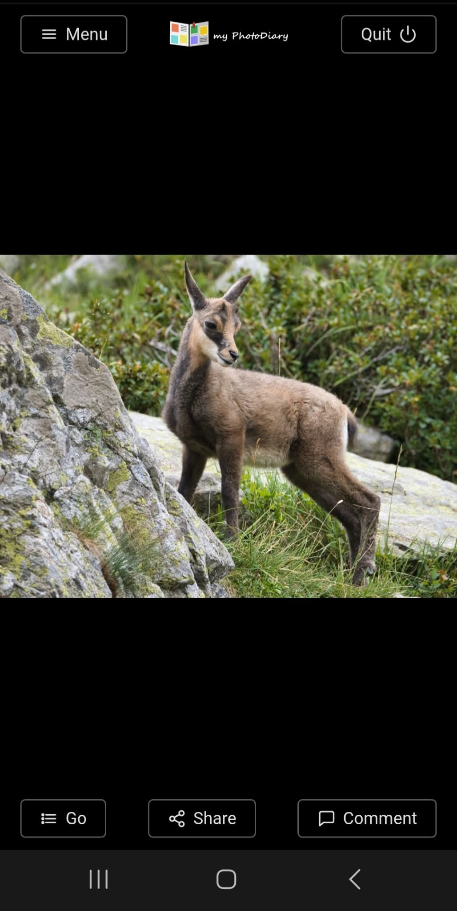
<figcaption>Single-picture view, a landscape picture letterboxed to fit the screen</figcaption>
</figure>

The normal way of looking at one picture at a time — what the app opens
to after selecting a sequence from Go (§9.2):
- **Swipe left** — next picture in the sequence. **Swipe right** —
  previous. There's no on-screen arrow for either, just the gesture.
- **Double-tap** the picture — reveals or hides the four corner buttons
  (§9.1); the same gesture also closes an open Go or Menu panel first,
  if one was left open (§9.2).
- **Pinch out** — switches to the mosaic view below, but only while the
  picture is at its normal, un-zoomed size; pinching out while already
  zoomed in still just zooms back out normally instead, unaffected.
- Turning the phone to **landscape**, then tapping anywhere once, goes
  full-screen automatically — it reclaims the space the phone's own
  address bar/toolbar would otherwise eat out of an already-short
  landscape view. Turning back to portrait exits full-screen by itself,
  no tap needed. **Android only** — deliberately not attempted on an
  iPhone or iPad, where real-device testing found the same trick
  unreliable.

### 10.2 Mosaic (thumbnail grid) view

<figure>
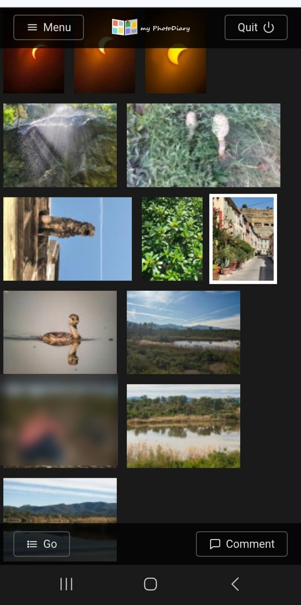
<figcaption>Mosaic view, the whole sequence as a grid of thumbnails</figcaption>
</figure>

Pinching out from the single-picture view switches to this grid of
every thumbnail in the current sequence, with the current picture
outlined in white:
- **Tap** a thumbnail to make it the current picture — the white
  outline moves to it, without leaving the mosaic.
- **Swipe left/right** — moves between *pages* of thumbnails, not
  individual pictures. How many rows fit on a page adjusts itself to
  however much vertical space is actually available, so turning the
  phone to portrait fits more rows than landscape does, on the same
  sequence.
- **Double-tap** — same as the single-picture view, reveals or hides
  the four corner buttons.
- **Pinch in** — back to the single-picture view, on whichever picture
  the white outline was last on.

### 10.3 The post-it comment

<figure>
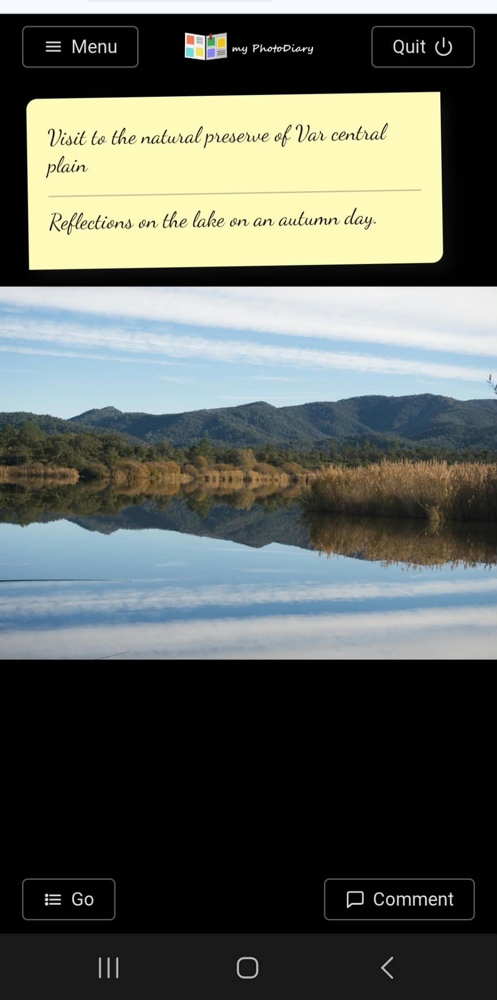
<figcaption>The post-it, showing both comments</figcaption>
</figure>

Tapping **Comment** (§9.1) shows the same two-part post-it as desktop
(§2.3) — the sequence's own comment above the divider, the current
picture's comment below — and it hides itself again on its own after
10 seconds if you don't touch it. Tapping either half opens it for
editing right away, closing the post-it in the process:

<figure>
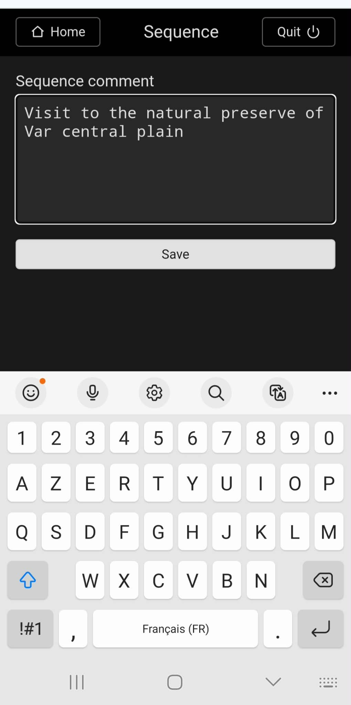
<figcaption>Editing a sequence's comment on mobile</figcaption>
</figure>
<figure>
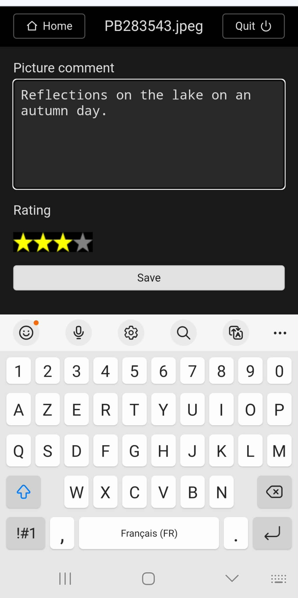
<figcaption>Editing a picture's comment and rating on mobile</figcaption>
</figure>

Both forms are deliberately reduced from their desktop equivalents
(§2.3): no group, tags, rename, or capture date here — the sequence
form is comment only, the picture form adds just a star **Rating** on
top of its own comment. Unlike desktop's save-as-you-go fields, both
mobile forms only save once you tap **Save**.

## 11. Mobile: Publishing, Camera and Filming

All three of the hamburger menu's (§9.3) remaining entries are used to publish new content as the desktop's Publish popup (§3). 

1. They share the same single checkbox, **Sort by date and create a new
   sequence**, with a sequence name field below it:

    - Checked, a new sequence is created in the navigation tree under the
      year and month recorded by the camera for each picture:

      **year/month/\<sequence name\>**

      If the selected pictures were taken in different months or years,
      one sequence with the same name is created at each of those dates.

    - Unchecked, the label turns into **Store photos in:** followed by
      the sequence you were visiting before opening the form (or
      **Root**), and every picture is stored there.

1. Then tap **Select pictures** to open the device's own
file/gallery picker, exactly like Publish pictures on desktop: pick one
or several pictures and videos at once from wherever they already are
on the device.

1. Then click the **Upload** button which actually
sends the selected image files. On a slow mobile connection, photos are
made smaller automatically before being sent, exactly as on desktop —
see §3 for how it works and what it means for the stored photo.

<figure>
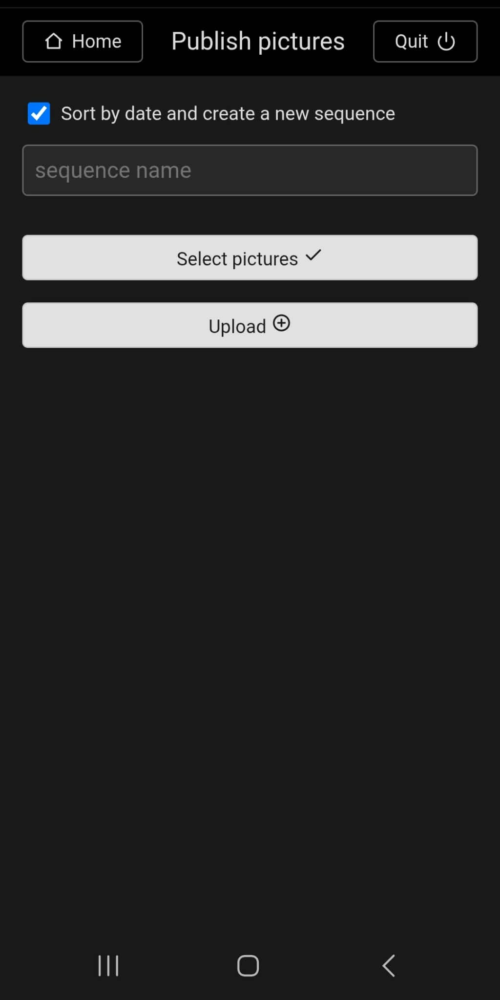
<figcaption>Publish, with the device's own file/gallery picker</figcaption>
</figure>

> We definitely recommend to use the Publish button as described above. 
> The two "experimental" options below directly 
> publish the output of the camera. It is more sensitive to network 
> failures and you cannot select the pictures you publish.
> There is one advantage to publish when you shot from the camera : 
> it usually keeps the image metadata which may be otherwise altered 
> by the smartphone software.

**Camera** — tap **Take a picture** to launch the device's own camera
app directly, shot and Publish **one picture at a time**. This entry
is photos only; there's no way to record a video from here (see Film,
next).

<figure>
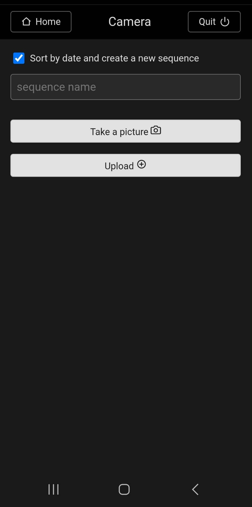
<figcaption>Camera, launching the device's own camera app</figcaption>
</figure>

**Film** — the video equivalent of Camera: tap **Record a video** to
launch the device's own camera app directly in video-recording mode and
shoot one video at a time. The same
`accept="video/mp4"` restriction the upload form always enforces for
video applies here too (see §3).

<figure>
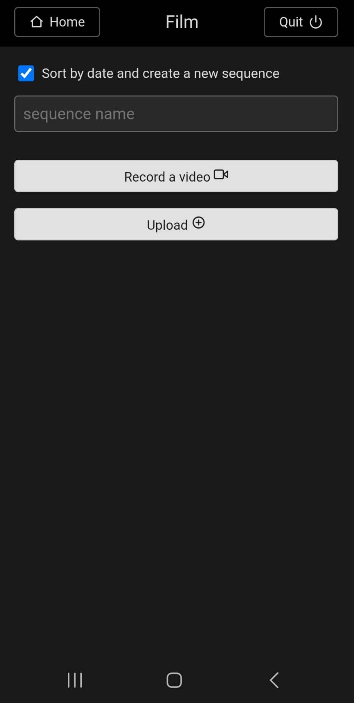
<figcaption>Film, launching the device's own camera app in video mode</figcaption>
</figure>

## 12. Mobile: Searching

<figure>
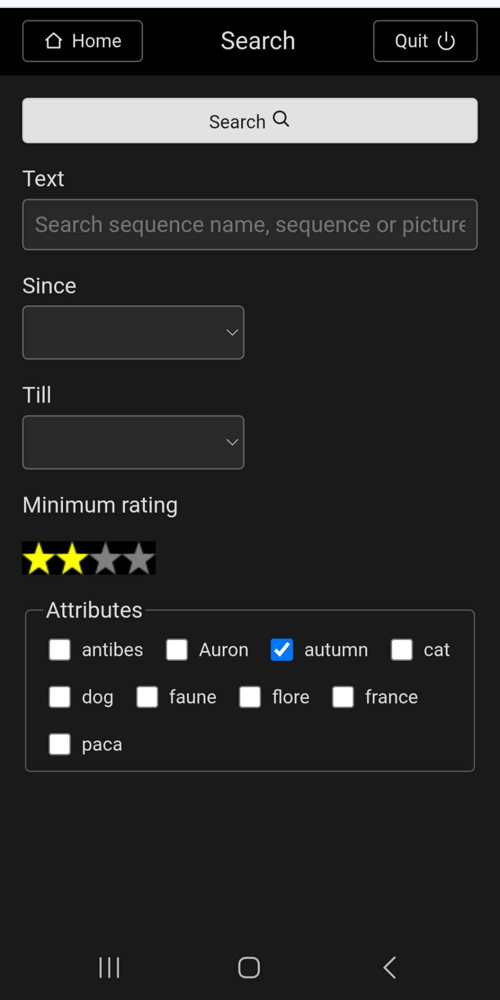
<figcaption>The mobile search form</figcaption>
</figure>

Reached from the hamburger menu's **Search** entry (§9.3), this is a
dedicated full-screen form with the same filters as the desktop Search
screen (§5) — free text, tags, minimum rating, and a date range — and
the same rules about how they combine: text and tags act as
alternatives to each other, rating and dates narrow the result further,
and a text search still needs at least 4 characters to count. Tapping
**Search** with every filter left empty briefly shows a reminder to
fill something in, rather than running an unfiltered search over the
whole collection.

Unlike desktop, there's no results grid of its own here: tapping
**Search** fetches every matching picture up front, then hands them
over to the normal home screen (§10) to browse — single-picture or
mosaic view, whichever was last used, with swipe/pinch/double-tap all
working exactly the same as on any other sequence.

One difference from browsing normally: while looking at a search
result, tapping **Go** (§9.2) doesn't reopen wherever you were browsing
before the search — it jumps straight to *that exact picture's own
sequence* in the navigation tree instead, dropping the search result in
the process. It's the fastest way to go from "found it" to "now show me
the rest of that trip".

## 13. Account Settings

There's no mobile equivalent of the Admin screen at all. To change your
own personal settings (slideshow delay, default map position, post-it
fade delay) — or to do anything administrative at all (users, groups,
roles, tags, index management) — sign in from a desktop browser instead
and see §8. Your own settings specifically live under §8.2, Configure,
reachable by any signed-in role, not just Admin.

## 14. Tips

> **Root image**: To personalize your site, it is good to store a "Root image"
> in the root directory - rather than left it black - and comment it with 
> a Welcome message.

> **Uploading from a slow connection**: photos are shrunk automatically
> to keep uploads fast (§3). If you care about keeping a photo at full
> resolution, wait until you're on a fast connection (home Wi-Fi) to
> publish it.

> **Language**: unlike the desktop interface (§2.1), mobile has no
> language switcher of its own — it always follows the phone's own
> browser/system language automatically. To force a specific language
> instead, open the app once with `?lng=en` (or `fr`/`de`/`es`) added to
> the end of the URL — it's remembered after that, on that phone, until
> you do the same thing again with a different code.

## 15. Glossary

- **Sequence** — a directory in the `year / month / sequence` tree that
  actually holds pictures and videos; what you browse, comment on, tag,
  and share (§2.1).
- **Current sequence** — the sequence whose pictures you're looking at
  right now, the one highlighted in the directory tree (§2.1) or reached
  through Go (§9.2); uploads go there when date sorting is off (§3).
- **Tag** (also called an *attribute* in a few places in the interface)
  — a free-form label attached to a sequence or a picture, independent
  of where it sits in the `year/month/sequence` tree; can be organized
  into a parent/child tree of its own (§4).
- **Post-it** — the note overlaid on the current picture, holding the
  sequence's own comment above a divider line and the current picture's
  comment below it (§2.3 on desktop, §10.3 on mobile).
- **Group** — the unit access is restricted by; every sequence and every
  user belongs to at least one, defaulting to a single shared `public`
  group unless you deliberately create more (§2.3, §8.1).
- **Role** — what a user is allowed to do within one particular group —
  Admin, Writer, Reader, or Lower (§8.1).
- **Shared link** — a signed, time-limited (30-day) URL that lets someone
  with no account view a single picture or a whole sequence, read-only,
  without signing in (§6, §9.4).
- **Picture editor** — the popup that rotates, crops, or straightens a
  picture, changing the stored picture itself (§2.5).
